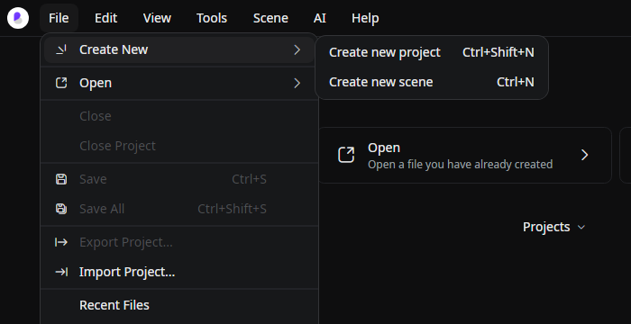
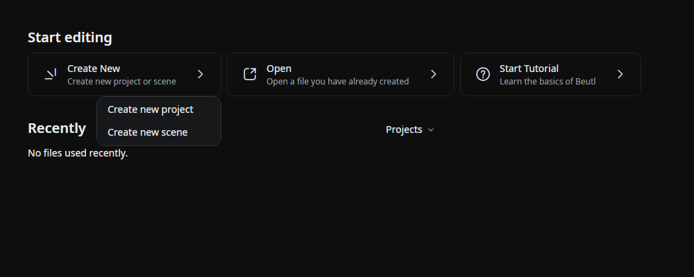
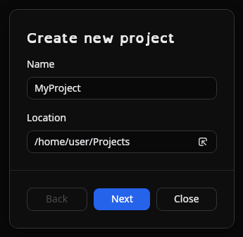
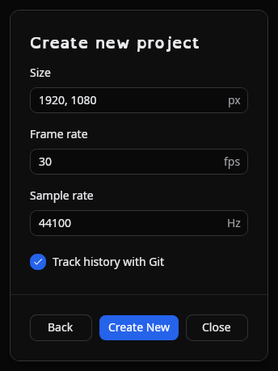

To create a project, go to the window menu and select __File > New > Project__, or  

Click __New > Create New Project__ on the start screen.  

Specify the project's name and location.  

Click __[Next]__.  

Specify the frame rate, sample rate, initial scene width, and height.  
  
_In Beutl, the specified sample rate will be used during output. It will not be used during preview playback._

Click __[Create]__ to create the project.

When Git is available, choose **Track history with Git** to start recording versions when the project is created. See [Version Control](../reference/tool-tabs/version-control.md).

## Recent projects

On the start screen, right-click a project in the recent list and choose **Delete from Disk** to permanently delete it. The confirmation dialog shows whether Beutl will delete the project's own folder and its contents, or only the project file when it is in a shared location. Close an open project before deleting it.

**Remove** only removes the entry from the recent list; it leaves the files on disk.

## Source

- [`EditorHostFallback.axaml`](https://github.com/b-editor/beutl/blob/v2.0.0-preview.8/src/Beutl/Views/EditorHostFallback.axaml) / [`.axaml.cs`](https://github.com/b-editor/beutl/blob/v2.0.0-preview.8/src/Beutl/Views/EditorHostFallback.axaml.cs)
- [`ProjectDiskDeletion.cs`](https://github.com/b-editor/beutl/blob/v2.0.0-preview.8/src/Beutl/Services/ProjectDiskDeletion.cs)
