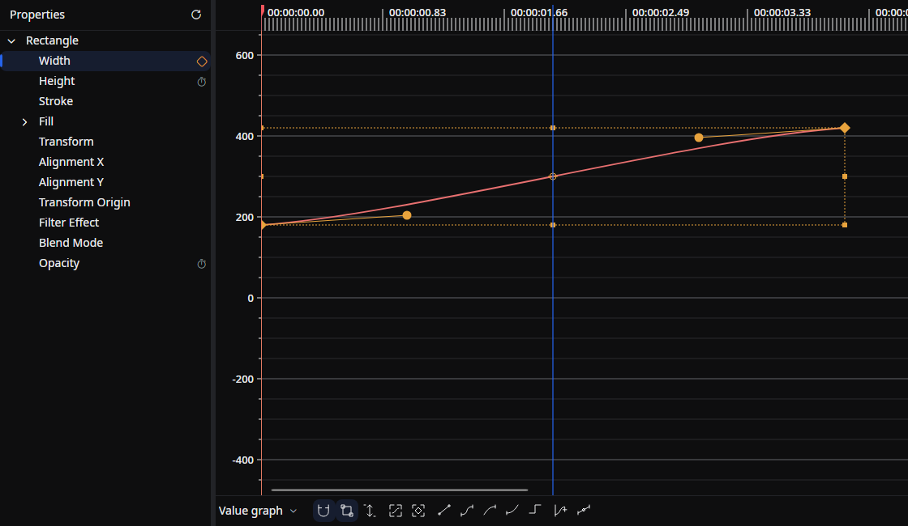

# Graph Editor

A tab for editing the **time curves** of animations on a 2D graph.
You can drag keyframe positions, values, and interpolation curves directly to fine-tune the acceleration and deceleration of motion.

## Tab characteristics

- **Open by default**: No
- **Allow multiple instances**: Yes (you can open a separate tab for each editing target)

## How to open

The Graph Editor tab does not appear in the **View → Tools** menu.
In the Properties tab, click the **vertical three-dot menu (⋮)** on the property you want to edit and choose **Edit animation** to open it.

You can also open the same animation in the Graph Editor tab from the **Open** icon button in the header of an inline animation on the timeline.

## Layout

- **Properties tree (left)**: A hierarchy of drawables, effects, transforms, nested properties, and value channels. Select a row to change the editing target.
- **Toolbar (below the graph)**: Value/speed graphs, snapping, transform box, automatic height, easing, keyframe velocity, and tangent linkage.
- **Timeline scale (top center)**: The time axis ruler. Shows the playback position and the scene start/end bars.
- **Vertical scale (center left)**: The value ruler. Lets you read values above and below the baseline (the 0 position).
- **Graph panel (center)**: The work area where keyframes and interpolation curves are drawn on a 2D graph.

## Working with the properties tree

- Expand a drawable to navigate effects, transforms, nested properties, and value channels.
- Use the timer button to enable animation and the diamond button to insert or remove a keyframe at the playhead.
- Remove an animation from its context menu. The tab remains when animations are removed; it closes when the target element is deleted.

## Graph and selection tools

**Value graph** shows property values; **Speed graph** shows their change per second. **Transform box** moves or scales the selected keyframes. **Auto height** manages the vertical range and disables manual vertical zoom and scrolling while enabled.

Apply Linear, Hold, Easy Ease, Ease In, or Ease Out from the toolbar. **Keyframe velocity** adjusts incoming/outgoing speed and influence.

## Handle modes

Switches how the opposite handle of an adjacent keyframe is treated when you drag a control point of a spline easing (Bezier curve).

- **Symmetry**: Moves the opposite handle in point symmetry with the dragged handle (same angle, same length).
- **Asymmetry**: Keeps the length of the opposite handle but aligns its angle.
- **Separately**: Leaves the opposite handle untouched and changes only the handle being dragged.

## Working with keyframes

Each keyframe is shown as a diamond icon.

### Move

- Left-drag to change the time and value at the same time.
- Use **Snap** to control time/value snapping. Hold **`Alt`** to temporarily disable it.
- **`Shift` + click** adds or removes a keyframe from the selection. Dragging acts on the selected keys; **`Shift` + drag** constrains movement horizontally or vertically.
- If the mouse leaves the scroll area while dragging, the view scrolls automatically.
- You can drag across adjacent keyframes; spline easing handles maintain their visual positions during the move.

### Right-click menu

- **Copy** — Copies the selection if the clicked keyframe is selected; otherwise copies that keyframe.
- **Paste** — Pastes at that keyframe's position (when the type does not match, only the easing is applied).
- **Delete** — Deletes the selection if the clicked keyframe is selected; otherwise deletes that keyframe.

## Working with control points (spline easing)

When the easing is a spline, **control points** are shown before and after each keyframe segment.

- Left-drag a control point to move it and reshape the Bezier curve.
- The opposite handle moves according to the **handle modes** described above.
- Hold `Alt` while dragging to ignore hit-testing on the keyframe side.

## Working with the graph panel

### Mouse wheel

- The wheel scrolls along the time axis.
- `Shift` + wheel scrolls vertically.
- `Alt` or `Ctrl` (`Cmd`) + wheel zooms in/out along the time axis (centered on the pointer).
- `Ctrl` + `Shift` (`Cmd` + `Shift`) + wheel zooms in/out vertically.
- The wheel over the vertical scale also scrolls vertically; holding `Alt` or `Ctrl` (`Cmd`) zooms vertically.

If **Swap the scroll direction of the timeline** is enabled in the settings, the vertical and horizontal behaviors are swapped.

### Operating the playback position and scene start/end

- Click on the timeline scale to move the playback position (seek bar) to that time.
- Drag the red scene start/end bars at the top to change the scene's start time and duration.

### Right-click menu on an empty area

- **Copy All** — Copies the entire animation of this property to the clipboard as JSON.
- **Paste** — Pastes a keyframe or animation at the mouse position.
  - When the clipboard contains a keyframe or selection: inserts it at the mouse position. If a keyframe already exists at the same time, its value and easing are overwritten.
  - When the clipboard contains an entire animation: replaces the existing animation in full.
  - If the keyframe's type does not match the property's, only the easing is applied.
- **Zoom**: 1% / 5% / 10% / 20% / 50% / 70% / 100% / 120% / 150% / 170% / 200% / 350% / 700% / 875% (vertical zoom level)
- **View**: A submenu for switching value components (only for properties with multiple components — see below).
- **BPM Grid** (BPM, beat, and offset settings)
- **Use the Global Clock** toggle

### Drag and drop

When you drop an easing item from the Library onto the graph panel, the behavior depends on the drop position.

- If there is an existing keyframe near the drop position, its **easing is changed**.
- If no keyframe is nearby, **a new keyframe is inserted** at the drop position and the specified easing is applied to that transition segment.

## Properties with multiple components

For properties that contain multiple inner values, such as coordinates, sizes, and colors, each component is drawn as a separate graph at the same time.

- For example, a 2D point uses **X / Y**, a 3D vector uses **X / Y / Z**, a rectangle uses **X / Y / Width / Height**, and a color uses **Alpha / Red / Green / Blue**.
- Use **View** in the right-click menu to switch the component being edited. Only the keyframes and handles of the selected component become interactive; the other components are drawn faintly as guides.
- Color graphs draw each channel in red, green, and blue.

## Selection and keyboard shortcuts

Hold `Ctrl` (`Cmd` on macOS) and drag an empty area to box-select, adding `Shift` to extend the selection. Use `Space` + left drag or middle-button drag to pan.

| Action | Keys |
|--------|------|
| Select all | `Ctrl/Cmd + A` |
| Clear selection | `Ctrl/Cmd + Shift + A` or `Shift + F2` |
| Copy / cut / paste selection | `Ctrl/Cmd + C/X/V` |
| Delete | `Delete` / `Backspace` |
| Fit all / fit selection | `F` / `Shift + F` |
| Easy Ease / Ease In / Ease Out | `F9` / `Shift + F9` / `Ctrl/Cmd + F9` |
| Move by 1 / 10 frames | `Alt + ←/→` / `Alt + Shift + ←/→` |
| Seek previous / next keyframe | `J` / `K` |

Shortcut paste inserts at the playhead while retaining relative intervals between selected keys. Paste from the empty-area context menu inserts at the pointer. Context-menu paste of a whole animation copied with **Copy All** replaces the existing animation.

## Global clock and element clock

When **Use the Global Clock** is enabled for an animation, moving the element does not change the displayed positions of the keyframes (they are always shown on the project's time scale, independent of the element's start time).
When it is disabled, keyframes are drawn as time relative to the element's start.

The element's bounds are overlaid on the graph panel as thin vertical lines in the layer color.

## Auto-scroll during playback

According to the **Settings > Editor settings > Timeline auto-scroll during playback** setting, the view scrolls automatically along with the playback position.

## Related documents

- [Keyframes](../../get-started/keyframe.md)
- [Timeline](./timeline.md) — Documentation for the lane that edits keyframes inline
- [Curves](./curves.md) — Tab for editing tone curves used in color correction

## Source

- [`GraphEditorView.Interaction.cs`](https://github.com/b-editor/beutl/blob/v2.0.0-preview.8/src/Beutl.Editor.Components/GraphEditorTab/Views/GraphEditorView.Interaction.cs)
- [`GraphEditorTabViewModel.Tree.cs`](https://github.com/b-editor/beutl/blob/v2.0.0-preview.8/src/Beutl.Editor.Components/GraphEditorTab/ViewModels/GraphEditorTabViewModel.Tree.cs)

- [`GraphEditorTabExtension.cs`](https://github.com/b-editor/beutl/blob/main/src/Beutl.Editor.Components/GraphEditorTab/GraphEditorTabExtension.cs)
- [`GraphEditorTabViewModel.cs`](https://github.com/b-editor/beutl/blob/main/src/Beutl.Editor.Components/GraphEditorTab/ViewModels/GraphEditorTabViewModel.cs)
- [`GraphEditorViewModel.cs`](https://github.com/b-editor/beutl/blob/main/src/Beutl.Editor.Components/GraphEditorTab/ViewModels/GraphEditorViewModel.cs)
- [`GraphEditorViewViewModel.cs`](https://github.com/b-editor/beutl/blob/main/src/Beutl.Editor.Components/GraphEditorTab/ViewModels/GraphEditorViewViewModel.cs)
- [`GraphEditorViewViewModelFactory.cs`](https://github.com/b-editor/beutl/blob/main/src/Beutl.Editor.Components/GraphEditorTab/ViewModels/GraphEditorViewViewModelFactory.cs)
- [`GraphEditorKeyFrameViewModel.cs`](https://github.com/b-editor/beutl/blob/main/src/Beutl.Editor.Components/GraphEditorTab/ViewModels/GraphEditorKeyFrameViewModel.cs)
- [`GraphEditorTabView.axaml`](https://github.com/b-editor/beutl/blob/main/src/Beutl.Editor.Components/GraphEditorTab/Views/GraphEditorTabView.axaml) / [`.axaml.cs`](https://github.com/b-editor/beutl/blob/main/src/Beutl.Editor.Components/GraphEditorTab/Views/GraphEditorTabView.axaml.cs)
- [`GraphEditorView.axaml`](https://github.com/b-editor/beutl/blob/main/src/Beutl.Editor.Components/GraphEditorTab/Views/GraphEditorView.axaml) / [`.axaml.cs`](https://github.com/b-editor/beutl/blob/main/src/Beutl.Editor.Components/GraphEditorTab/Views/GraphEditorView.axaml.cs)
- [`GraphEditorBackground.cs`](https://github.com/b-editor/beutl/blob/main/src/Beutl.Editor.Components/GraphEditorTab/Views/GraphEditorBackground.cs) / [`GraphEditorScale.cs`](https://github.com/b-editor/beutl/blob/main/src/Beutl.Editor.Components/GraphEditorTab/Views/GraphEditorScale.cs)
- [`KeyTimeBehavior.cs`](https://github.com/b-editor/beutl/blob/main/src/Beutl.Editor.Components/GraphEditorTab/Views/KeyTimeBehavior.cs) / [`ControlPointBehavior.cs`](https://github.com/b-editor/beutl/blob/main/src/Beutl.Editor.Components/GraphEditorTab/Views/ControlPointBehavior.cs)
- [`GraphEditorDragDropBehavior.cs`](https://github.com/b-editor/beutl/blob/main/src/Beutl.Editor.Components/GraphEditorTab/Views/GraphEditorDragDropBehavior.cs)
- [`EaseLine.cs`](https://github.com/b-editor/beutl/blob/main/src/Beutl.Editor.Components/GraphEditorTab/Views/EaseLine.cs)
- [`GraphEditorResources.axaml`](https://github.com/b-editor/beutl/blob/main/src/Beutl.Editor.Components/GraphEditorTab/Resources/GraphEditorResources.axaml)
- [`PropertyEditorMenu.axaml.cs`](https://github.com/b-editor/beutl/blob/main/src/Beutl/Views/Editors/PropertyEditorMenu.axaml.cs) (entry point for opening the tab)
