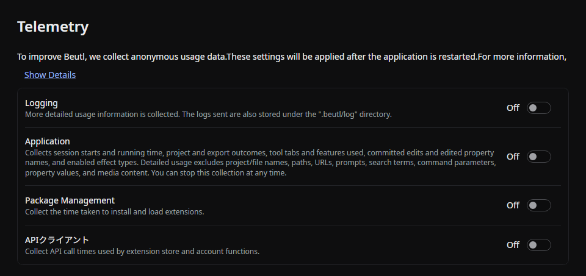

Open **Settings → Telemetry** to choose which information Beutl collects.

## Application

The **Application** switch controls detailed desktop usage collection. This includes session starts and running time, project and export outcomes, tool tabs and features used, committed edits and edited property names, and enabled effect types.

Detailed usage excludes project and file names, paths, URLs, prompts, search terms, command parameters, property values, and media content. You can stop this collection at any time by turning **Application** off.

## Logging

Enabling **Logging** also enables the application, package-management, and API-client telemetry switches. Turn logging off before disabling those switches individually.

## Source

- [`TelemetrySettingsPage.axaml`](https://github.com/b-editor/beutl/blob/v2.0.0-preview.8/src/Beutl/Pages/SettingsPages/TelemetrySettingsPage.axaml)
- [`TelemetrySettingsPageViewModel.cs`](https://github.com/b-editor/beutl/blob/v2.0.0-preview.8/src/Beutl/ViewModels/SettingsPages/TelemetrySettingsPageViewModel.cs)
- [`UsageTelemetry.cs`](https://github.com/b-editor/beutl/blob/v2.0.0-preview.8/src/Beutl.Editor/Services/UsageTelemetry.cs)
- [`SettingsStrings.resx`](https://github.com/b-editor/beutl/blob/v2.0.0-preview.8/src/Beutl.Language/SettingsStrings.resx)
