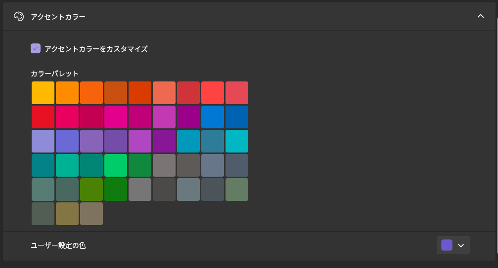

## Theme

- **Dark** — Beutl's own near-black design. This is the default.
- **Dark (Classic)** — the plain dark theme, without the design overrides that **Dark** layers on top of it.
- **Light**
- **High Contrast**
- **Follow System**

A theme can bring its own accent color, which is used unless you set an [accent color](#accent-color) of your own. **Dark** uses a blue accent (`#2563EB`); the other built-in themes leave the accent to the OS.

Extensions can add themes of their own, and any theme they register appears in this list alongside the built-in ones. See [Types of Extensions You Can Develop](../extensions/available-extensions.md).

:::note
Settings from Beutl 1.x are migrated automatically. A profile that had **Light**, **High Contrast**, or **Follow System** selected keeps that theme; one that was still on the old default gets the new **Dark** design theme.
:::

## Language

- Japanese
- English

## Accent Color

You can set any color.

