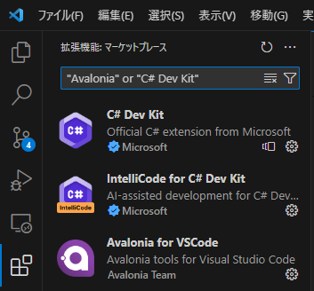
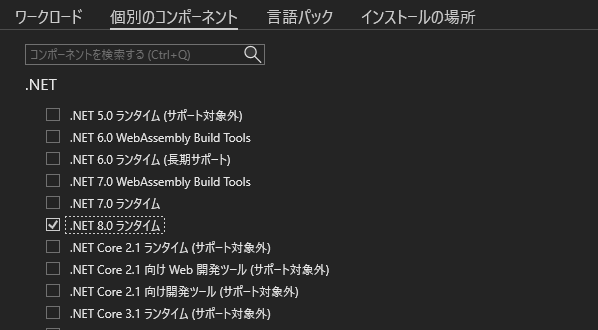
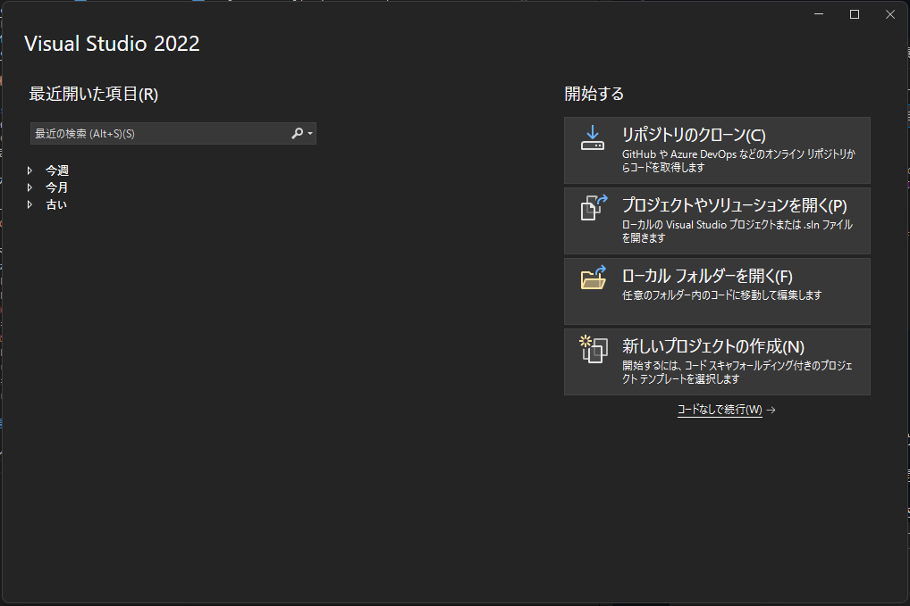
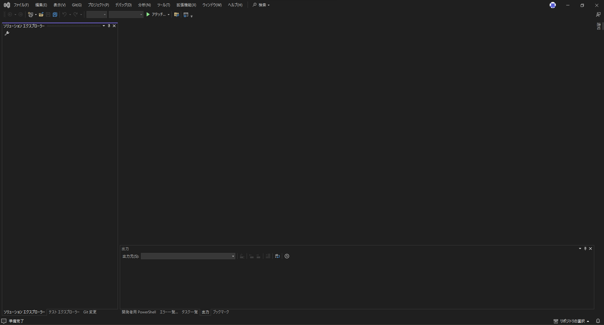
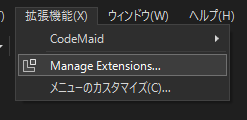
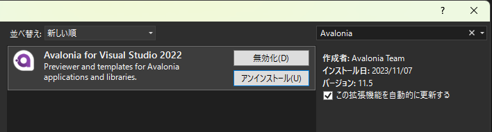

This article explains how to set up the development environment necessary for developing Beutl extensions.

This guide introduces the methods using __Visual Studio Code__ or __Visual Studio__.

## Visual Studio Code

### Installation
1. Install the [.NET SDK](https://dotnet.microsoft.com/en-us/download).  
> [!TIP]
> Select the .NET SDK version according to the Beutl version you are targeting.  
> [Version Compatibility Table](version-mapping.md)

2. Install __Visual Studio Code__ for your development environment from [this page](https://code.visualstudio.com/Download).

### Install Extensions in Visual Studio Code
3. Install [C# Dev Kit](https://marketplace.visualstudio.com/items?itemName=ms-dotnettools.csdevkit) in __Visual Studio Code__.
> [!TIP]
> If you are developing UI extensions, install [Avalonia for VSCode](https://marketplace.visualstudio.com/items?itemName=AvaloniaTeam.vscode-avalonia).

## Visual Studio
_Windows only_

### Installation
1. Download __Visual Studio__ from [this page](https://visualstudio.microsoft.com/en/vs/).

2. Open the downloaded installer.

3. When the workload selection screen appears, open individual components.

4. Select the following components.  
   (This is the minimum configuration. Add as needed.)
  - `.NET 8.0 Runtime` or `.NET 7.0 Runtime`
  - `.NET SDK`
  - `NuGet Package Manager`
  - `C# and Visual Basic Roslyn Compilers`
  - `MSBuild`
  - `.NET Profiling Tools`
  - `Just-In-Time Debugger`
  - `C# and Visual Basic`
  - `IntelliCode`

5. Set the __Language Pack__ and __Installation Location__, then click Install.

### Install Extensions in Visual Studio

_You can skip this section if you are not developing UI extensions._

6. After installation, the following start window opens.

Click __Continue without code__ in the lower right to open the following window.

7. From the top menu, click __Extensions > Manage Extensions__.

8. In the displayed window, install __Avalonia for Visual Studio 2022__.

----

The environment setup is now complete.  
If any issues arise, please refer to the official documentation for __Visual Studio Code__ or __Visual Studio__.
- [Visual Studio Code](https://code.visualstudio.com/docs/setup/setup-overview)
- [Visual Studio](https://learn.microsoft.com/en-us/visualstudio/install/install-visual-studio?view=vs-2022)
