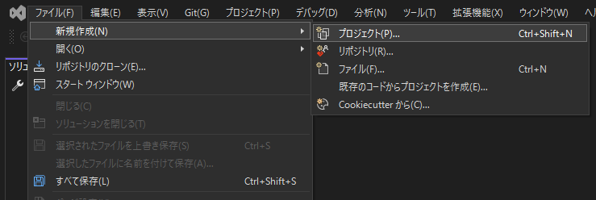
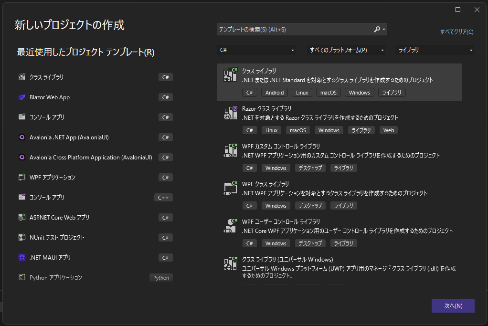
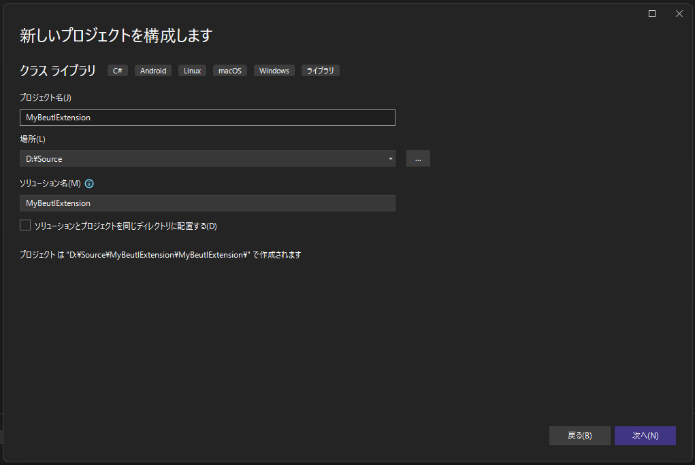
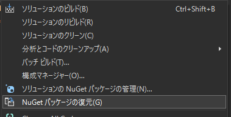

This article explains how to create an empty C# project for Beutl extensions.

This guide introduces the methods using __Visual Studio Code__ or __Visual Studio__.
The target Beutl version is `1.0.0-preview.6`.

## Visual Studio Code
1. Use the terminal to create a class library.  
```sh
dotnet new classlib -o MyBeutlExtension
```

Ensure the directory structure is as follows:
```
MyBeutlExtension
┣━ obj
┃  ┗━ (...)
┣━ Class1.cs
┗━ MyBeutlExtension.csproj
```

2. Edit the generated `MyBeutlExtension.csproj` as follows:
```xml
<Project Sdk="Microsoft.NET.Sdk">
  <PropertyGroup>
    <!-- Change the TargetFramework according to the Beutl version -->
    <TargetFramework>net8.0</TargetFramework>
    <ImplicitUsings>enable</ImplicitUsings>
    <Nullable>enable</Nullable>

    <!-- The following are optional. -->
    <RepositoryUrl>url/to/repository</RepositoryUrl>
    <PackageId>MyBeutlExtension</PackageId>
    <Title>Sample Extension</Title>
    <Description>Sample</Description>
    <PackageTags>sample</PackageTags>
    <Version>1.0.0</Version>
    <AssemblyVersion>1.0.0.0</AssemblyVersion>
    <Authors>Author Name</Authors>
  </PropertyGroup>

  <!-- Ensure the build is recognized as a sideload extension. -->
  <PropertyGroup Condition="'$(Configuration)'=='Debug'">
    <AppendTargetFrameworkToOutputPath>false</AppendTargetFrameworkToOutputPath>
    <AppendRuntimeIdentifierToOutputPath>false</AppendRuntimeIdentifierToOutputPath>
    <EnableDynamicLoading>true</EnableDynamicLoading>
    <OutputPath>$([System.Environment]::GetFolderPath(SpecialFolder.UserProfile))\.beutl\sideloads\$(AssemblyName)</OutputPath>
  </PropertyGroup>

  <ItemGroup>
    <PackageReference Include="Beutl.Extensibility" Version="1.0.0-preview.6" />
    <PackageReference Include="Beutl.ProjectSystem" Version="1.0.0-preview.6" />
    <PackageReference Include="Beutl.Operators" Version="1.0.0-preview.6" />
  </ItemGroup>

</Project>
```

3. Run the following commands to generate `nuget.config` and add the package source.
```sh
dotnet new nugetconfig
dotnet nuget add source "https://nuget.beditor.net/v3/index.json" --name nuget.beditor.net
```

This completes the creation of an empty C# project for extensions.

## Visual Studio
1. Open Visual Studio and click __File > New > Project__.  


2. Select Class Library and click Next.  


3. Enter the project name and location, then click Next.


4. Select the framework according to the Beutl version.

5. Click Create.

Ensure the directory structure is as follows:
```
MyBeutlExtension
┣━ MyBeutlExtension
┃  ┣━ obj
┃  ┃  ┗━ (...)
┃  ┣━ Class1.cs
┃  ┗━ MyBeutlExtension.csproj
┗━ MyBeutlExtension.sln
```

6. Edit the generated `MyBeutlExtension.csproj` as follows:
```xml
<Project Sdk="Microsoft.NET.Sdk">
  <PropertyGroup>
    <!-- Change the TargetFramework according to the Beutl version -->
    <TargetFramework>net8.0</TargetFramework>
    <ImplicitUsings>enable</ImplicitUsings>
    <Nullable>enable</Nullable>

    <!-- The following are optional. -->
    <RepositoryUrl>url/to/repository</RepositoryUrl>
    <PackageId>MyBeutlExtension</PackageId>
    <Title>Sample Extension</Title>
    <Description>Sample</Description>
    <PackageTags>sample</PackageTags>
    <Version>1.0.0</Version>
    <AssemblyVersion>1.0.0.0</AssemblyVersion>
    <Authors>Author Name</Authors>
  </PropertyGroup>

  <!-- Ensure the build is recognized as a sideload extension. -->
  <PropertyGroup Condition="'$(Configuration)'=='Debug'">
    <AppendTargetFrameworkToOutputPath>false</AppendTargetFrameworkToOutputPath>
    <AppendRuntimeIdentifierToOutputPath>false</AppendRuntimeIdentifierToOutputPath>
    <EnableDynamicLoading>true</EnableDynamicLoading>
    <OutputPath>$([System.Environment]::GetFolderPath(SpecialFolder.UserProfile))\.beutl\sideloads\$(AssemblyName)</OutputPath>
  </PropertyGroup>

  <ItemGroup>
    <PackageReference Include="Beutl.Extensibility" Version="1.0.0-preview.6" />
    <PackageReference Include="Beutl.ProjectSystem" Version="1.0.0-preview.6" />
    <PackageReference Include="Beutl.Operators" Version="1.0.0-preview.6" />
  </ItemGroup>

</Project>
```

7. Run the following commands to generate `nuget.config` and add the package source.
```sh
dotnet new nugetconfig
dotnet nuget add source "https://nuget.beditor.net/v3/index.json" --name nuget.beditor.net
```

8. Click __Restore NuGet Packages__ to ensure that NuGet dependencies are restored correctly.  


This completes the creation of an empty C# project for extensions.
