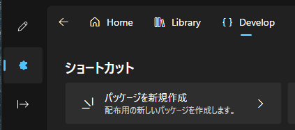
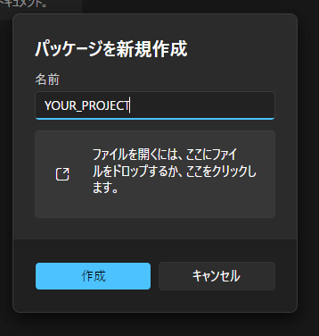
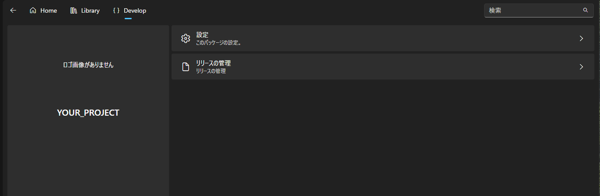
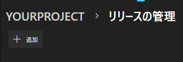
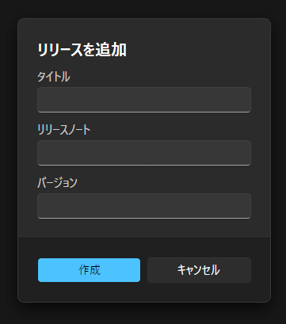
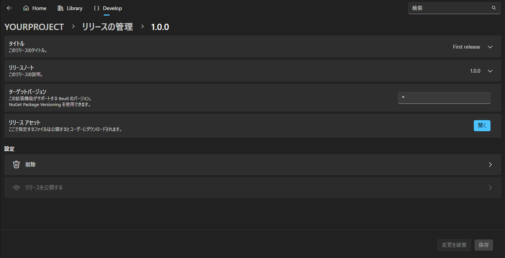
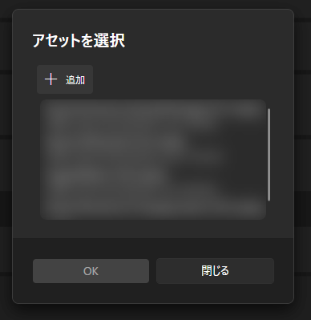
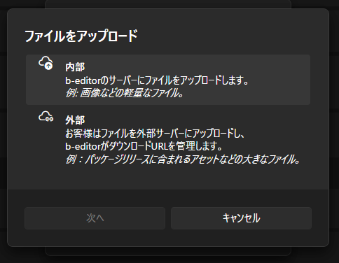
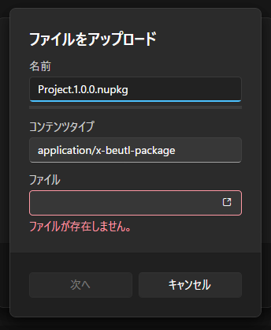

This guide explains how to publish Beutl extensions to the store.

_In this guide, the C# project name is `YOUR_PROJECT`._

## Creating a NuGet Package
Run the following command in the directory where `YOUR_PROJECT.csproj` is located:
```sh
dotnet pack -c Release
```

This will generate a `YOUR_PROJECT.1.0.0.nupkg` file as shown below:
```
YOUR_PROJECT
┣━ YOUR_PROJECT.csproj
┗━ bin
    ┗━ Release
        ┗━ YOUR_PROJECT.1.0.0.nupkg
```

## Creating a New Package
1. Open Extensions from the right-side navigation.

2. Open the Develop page and click `Create New Package`.  


3. Enter `YOUR_PROJECT`.

4. Click __[Create]__.

> [!TIP]
> You can automatically fill in the title and description by selecting the nupkg or nuspec file.


## Creating a Release
> [!TIP]
> If you selected the nupkg or nuspec file in the previous step, a release will be created automatically.

1. Click __[Manage Releases]__.  


2. Click __[Add]__.  


3. Enter the title, content, and version.
   The version should match the version of the NuGet package.


4. Click __[Create]__.

## Uploading
1. Click __[Manage Releases]__.

2. Click the desired release.

3. Click __[Open]__ under Release Assets.


4. A dialog to select assets will appear.


5. Click __[Add]__.

6. For this guide, we will upload to the Beutl server. Click Internal.
   (Choosing External allows you to specify a URL and file hash for GitHub or other sources.)


7. Enter the file name.

8. Select the file to upload.


9. Click Next to upload.

10. Close the dialog.

11. Click Save in the bottom right.

12. Click __[Publish]__.
   (To make the package available for download, you need to change the package's publication settings.)

## Publishing the Package
1. Click __[Edit]__ for the package you want to publish from __Extensions > Develop__.

2. Open the settings.

3. Click __[Publish Package]__.
