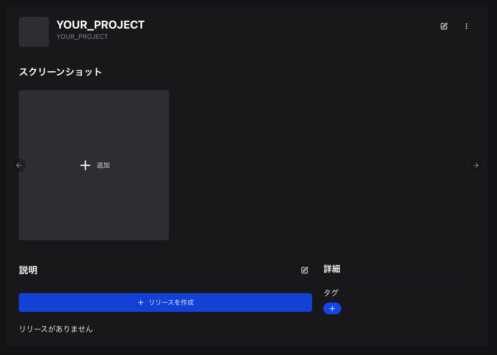
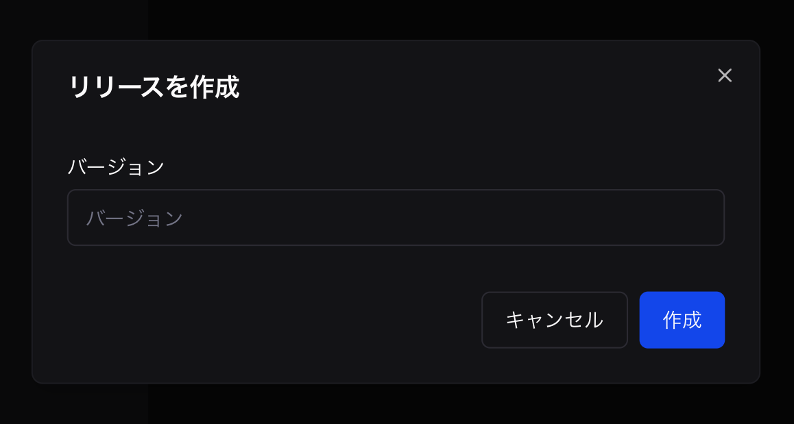
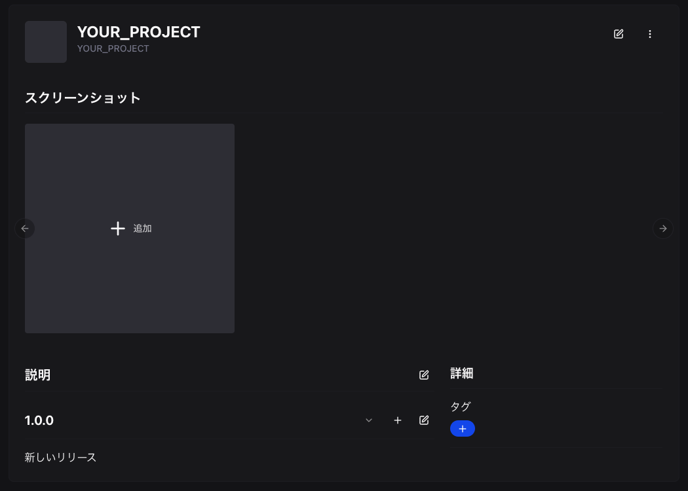
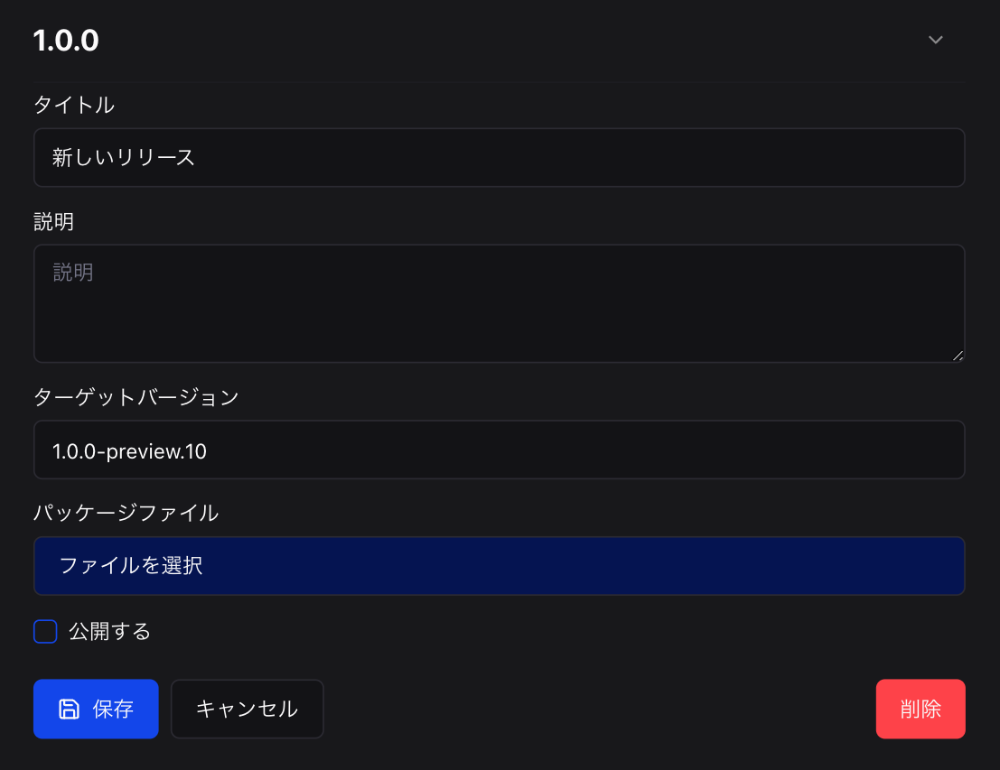
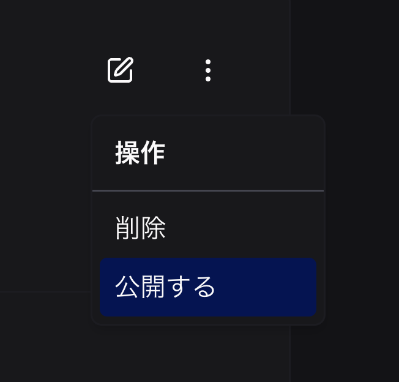

This guide explains how to publish Beutl extensions to the store.

_In this guide, the C# project name is `YOUR_PROJECT`._

## Creating a NuGet Package
Run the following command in the directory where `YOUR_PROJECT.csproj` is located:
```sh
dotnet pack -c Release
```

This will generate a `YOUR_PROJECT.1.0.0.nupkg` file as shown below:
```
YOUR_PROJECT
┣━ YOUR_PROJECT.csproj
┗━ bin
    ┗━ Release
        ┗━ YOUR_PROJECT.1.0.0.nupkg
```

## Creating a New Package
1. Go to [Developer](https://beutl.beditor.net/en/developer)
2. Sign in if you are not already signed in. 3.
3. Click __[Create New Extension]__.
   
4. Enter the package ID (in this case, YOUR_PROJECT)
5. Click __[Create]__.
   ! [Create Package](_images/4.publish/create-project-page.png)

## Creating a Release

1. Click __[Create Release]__.
   
2. Enter the version.
   
3. Click __[Create]__.
4. The release will be created.
   
5. Click the edit button.
6. Click __[Select File]__.
   
7. Select `YOUR_PROJECT.1.0.0.nupkg`.

8. Click __[Publish]__.
   (To make the package available for users to download, you need to change the package's publish settings)
9. Click __[Save]__.

## Publishing the Package
Click __[Publish]__.


