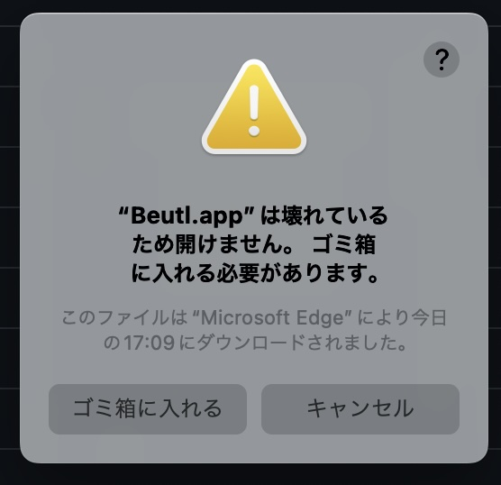

This document explains how to install Beutl.

The version of Beutl being installed in this document is referred to as `{version}`.

## Prerequisites
Install [.NET 8](https://dotnet.microsoft.com/ja-jp/download/dotnet/8.0).

> [!TIP]
> Determine the version of .NET to install based on the version of Beutl.  
> [Version Compatibility Table](../extensions/version-mapping.md)

## For Windows

### Using the Installer
1. Download and run `beutl-setup.exe`.
2. Follow the on-screen instructions to install.
3. Refer to [Installing FFmpeg](../ffmpeg-install.md) to install FFmpeg.
4. Launch `Beutl.exe`.

### Manual Installation
1. Download and extract `beutl-win-x64-{version}.zip`.
2. Refer to [Installing FFmpeg](../ffmpeg-install.md) to install FFmpeg.
3. Launch `Beutl.exe`.

## For Ubuntu 22.04

### Installing from Debian Package

> [!TIP]
> This method is available from `1.0.0-preview.5`.

1. Download `beutl_1.0.0-285ubuntu22.04_amd64.deb`.
2. Execute the following commands:
```sh
sudo apt update
sudo apt install ./beutl_1.0.0-285ubuntu22.04_amd64.deb
```
3. Installation is complete.

### Manual Installation
1. Download and extract `beutl-linux-x64-{version}.zip`.
2. Refer to [Installing FFmpeg](ffmpeg-install.md) to install FFmpeg.
3. Use `chmod` to make `Beutl`, `Beutl.ExceptionHandler`, `Beutl.PackageTools`, and `Beutl.WaitingDialog` executable.
4. Launch `Beutl`.

> [!IMPORTANT]
> If installing a version prior to `1.0.0-preview.5`,
> refer to [this guide](https://github.com/shimat/opencvsharp#ubuntu) to build `libOpenCvSharpExtern`.

## For macOS

Download and extract either `Beutl.osx_arm64.app.zip` or `Beutl.osx_x64.app.zip`.
You may see a warning like the one below.


This warning appears because I have not signed the application.
To bypass this warning, execute the following command:
```sh
xattr -rc Beutl.app
```
