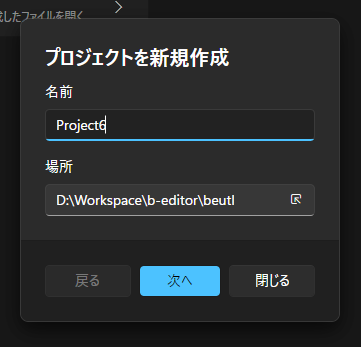

To create a project, go to the window menu and select __File > New > Project__, or  

Click __New > Create New Project__ on the start screen.  

Specify the project's name and location.  

Click __[Next]__.  

Specify the frame rate, sample rate, initial scene width, and height.  
  
_In Beutl, the specified sample rate will be used during output. It will not be used during preview playback._

Click __[Create]__ to create the project.
