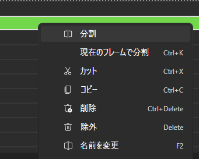

This page explains how to add effects to elements, move them, and more.

## Prerequisite Knowledge

This page uses terms such as __Source Operation__ and __Drawing Object__.
For details, please refer to [here](../advanced/1.rendering-process.md).

How to distinguish on the UI

</img>

## Adding Effects
First, select the element you want to add on the timeline.
The properties of the selected element will be displayed in the __Source Operation__ tab on the right.

To add an effect directly to a drawing object,
click the `+` button in __Filter Effects__ and select the effect you want to add.  

Alternatively, you can drag and drop the effect you want to add from the library to __Filter Effects__.  

If you drag and drop it elsewhere, you can add the effect as a source operation.  

## Transform
Using transform, you can express movement, rotation, scaling, distortion, and more.

To set a transform directly on a drawing object,
click the `+` button in __Transform__ and select the type of transform you want to add.

Only for move transform, you can move it with the mouse from the preview screen.
However, move transforms added as effects (or source operations) cannot be moved with the mouse.

## Editing Element Time
By dragging with the mouse on the timeline,
you can edit the start time and duration of elements.

To make editing easier in Beutl, elements snap to the time of other layers during drag operations.
To temporarily disable this, drag while holding down the `Alt` key.
This feature __cannot be permanently disabled__ in the settings screen.

## Splitting Elements
Right-click the element you want to split on the timeline and click the split button in the menu to split the element.
You can also use the `Ctrl + K` shortcut to split the selected element at the current frame.

## Renaming Elements
In Beutl, you can change the color and name of elements,
both of which can be changed from the right-click menu.

You can change the name with the `F2` key or by double-clicking the element.
