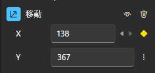

In Beutl, you can add animation effects to various objects using keyframes.

This guide assumes you already understand what keyframes are.

## Preparation
Here's how to enable animation:
1. Click the ︙ (vertical ellipsis) on the property you want to animate.

2. Click __Edit Animation Inline__ or __Edit Animation__.

3. Animation is now enabled, and the ︙ (vertical ellipsis) changes to a ◇ (diamond) icon. In this state, you can right-click to open the menu.

## Adding/Removing Keyframes

To add a keyframe at a specific frame, click the ◇ icon.
It will change to ◆, indicating that a keyframe has been added.

You can also drag and drop the desired easing from the easing list to add it.

Click the ◆ icon again to remove the keyframe.

## Navigating to Keyframes
When animation is enabled on a property, it should look like this:

Clicking the `<` or `>` buttons will move you to the previous or next keyframe.

## Easing
You can edit easing by opening the animation editor from the __Edit Animation__ menu.

To change the easing of an existing keyframe, drop the desired easing from the easing list onto the keyframe.

The default easing is spline easing, which allows you to adjust acceleration and deceleration using the green circle control points.

> [!TIP]
> If the control points overlap with the keyframe display and you cannot move the control points, hold down the `Alt` key while dragging to move the control points.

## Deleting Animation
To delete all keyframes and disable animation, right-click the ◇ icon and click __Delete Animation__ from the menu.

In complex scenes, deleting unused animations can improve rendering speed.
