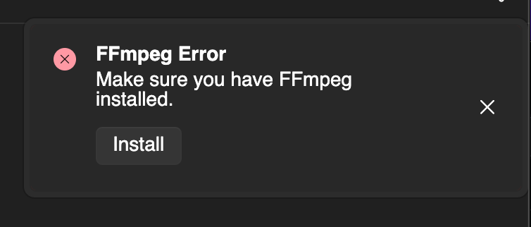

Before performing this operation, please review the FFmpeg license.  
https://www.ffmpeg.org/legal.html

## Manual Configuration

**The files to be downloaded may change due to updates.**

### For Windows (64bit)
Download `ffmpeg-n8.0-latest-win64-gpl-shared-8.0.zip` from the following page:  
https://github.com/BtbN/FFmpeg-Builds/releases

Extract the downloaded file and place the files from `ffmpeg-n8.0-latest-win64-gpl-shared-8.0\bin\` as follows:

```
C:\Users\(your_username)\.beutl\ffmpeg
┣━ avcodec-62.dll
┣━ avdevice-62.dll
┣━ avfilter-11.dll
┣━ avformat-62.dll
┣━ avutil-60.dll
┣━ ffmpeg.exe
┣━ ffplay.exe
┣━ ffprobe.exe
┗━ swresample-6.dll
┗━ swscale-9.dll
```

### For Linux
**FFmpeg installed via package manager may not work correctly due to version differences. Therefore, follow the same steps as for Windows.**

Download `ffmpeg-n8.0-latest-linux64-gpl-shared-8.0.tar.xz` from the following page:  
https://github.com/BtbN/FFmpeg-Builds/releases

Extract the downloaded file and place the files from `bin/` and `lib/` as follows:

```
/home/(your_username)/.beutl/ffmpeg
┣━ ffmpeg
┣━ ffplay
┣━ ffprobe
┣━ libavcodec.so
┣━ libavcodec.so.62
┣━ libavdevice.so
┣━ libavdevice.so.62
┣━ libavfilter.so
┣━ libavfilter.so.11
┣━ libavformat.so
┣━ libavformat.so.62
┣━ libavutil.so
┣━ libavutil.so.60
┣━ libswresample.so
┣━ libswresample.so.6
┣━ libswscale.so
┣━ libswscale.so.9
┣━ libavcodec.so.62.x.xxx
┣━ libavdevice.so.62.x.xxx
┣━ libavfilter.so.11.x.xxx
┣━ libavformat.so.62.x.xxx
┣━ libavutil.so.60.x.xxx
┣━ libswresample.so.6.x.xxx
┗━ libswscale.so.9.x.xxx
```
The files with the suffix `x.xxx` are symbolic links.

### For macOS

> [!WARNING]
> Do not use Rosetta.

Run the following command in the terminal to install Homebrew:
```sh
/bin/bash -c "$(curl -fsSL https://raw.githubusercontent.com/Homebrew/install/HEAD/install.sh)"
```

Then, run the following command to install FFmpeg:
```sh
brew install ffmpeg@8
```

## In-App Configuration

> [!TIP]
> Available from version 1.1.0.

If FFmpeg is not installed, a notification like the following will appear when you start Beutl.


Clicking the __Install__ button on this notification will launch the FFmpeg installation dialog.

In this dialog, you can install FFmpeg from BtbN/FFmpeg-Builds for Windows and Linux, and from Homebrew for macOS.
If Homebrew is not installed, it will be installed automatically.

## Using the [FFmpeg Configuration Tool](https://beutl.beditor.net/store/packages/Beutl.Extensions.FFmpegLocator)

> [!WARNING]
> This extension is planned to be deprecated.

From version `1.0.0-preview4` onwards, you can use the [FFmpeg Configuration Tool](https://beutl.beditor.net/store/packages/Beutl.Extensions.FFmpegLocator).

> [!TIP]
> You need a Beutl account to use this method.  
> Please sign in beforehand from the Account page in the Settings window.

1. open the __Tools > Extensions__ window
2. click on __"FFmpeg配置ツール"__.
4. Click Install.
5. Close Beutl.
6. Follow the instructions in the installation dialog.
7. Open Beutl.
8. Open __"FFmpeg配置ツール"__ from __Tools__.
9. Click __Install__ to start the installation of FFmpeg.
10. After the installation is complete, restart Beutl to finish the configuration.

> [!TIP]
> After completing this task, you can uninstall the __"FFmpeg配置ツール"__ if you wish.

## Troubleshooting

### FFmpeg Version Issues
If the message __"Please ensure FFmpeg is installed."__ appears even after installation, the FFmpeg version may be incorrect. Please check the correct version from the [Version Mapping](../extensions/version-mapping.md).

If you see the message despite using the FFmpeg Configuration Tool, please report it [here](https://github.com/b-editor/Beutl.Extensions.FFmpegLocator/issues).
