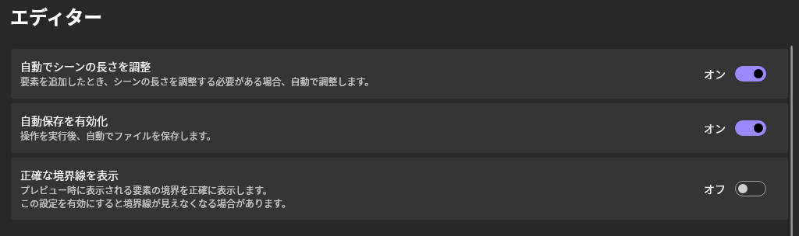
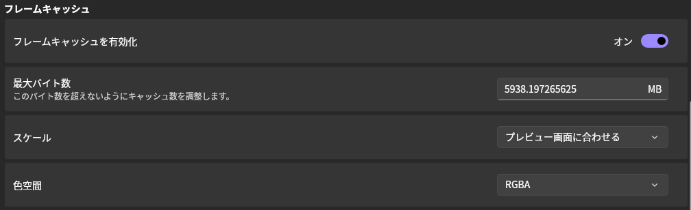
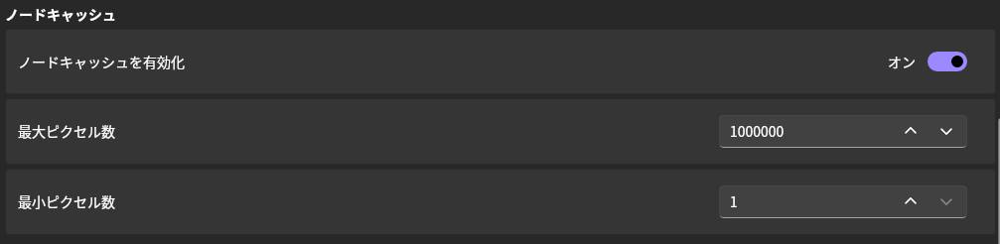
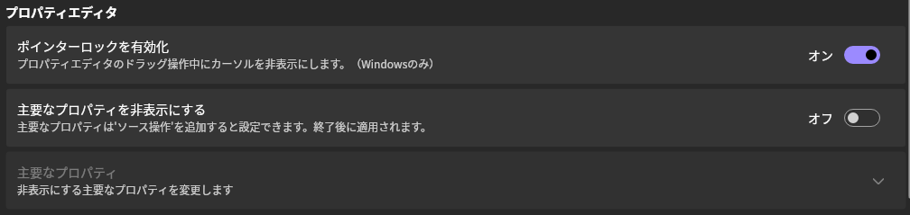

## Automatically Adjust Scene Length

When enabled, the scene length will be automatically adjusted when an element is added if necessary.

## Enable Auto-Save

When enabled, files will be automatically saved after performing actions.

## Show Precise Boundaries

When enabled, the boundaries displayed during the preview will be shown precisely.

For objects like rectangles, the boundary lines might overlap with the drawing content, making the boundaries invisible.

## Frame Cache

### Enable Frame Cache

When enabled, frame caching is activated.

The default setting is __"On"__.

### Maximum Byte Size

Adjust the cache size to not exceed this byte size (in megabytes).

The default value is half of the device's memory capacity.

### Scale

When saving the cache to memory, use this setting to reduce resolution to save memory.

- Original
- Match preview screen __(default value)__
- Half
- Quarter

> [!TIP]
  If the preview screen size is equal to or larger than the original size, the resolution remains unchanged.

### Color Space

When saving the cache to memory, use this setting to change the color space to save memory.

- RGBA __(default value)__
- YUV

> [!TIP]
> YUV uses I420.

## Node Cache

### Enable Node Cache

When enabled, node caching is activated.

The default setting is __"On"__.

### Maximum Pixel Count

Nodes exceeding this pixel count will not be cached.

The default value is __"1000000"__.

### Minimum Pixel Count

Nodes below this pixel count will not be cached.

The default value is __"1"__.

## Property Editor

### Enable Pointer Lock

Locks the cursor and hides it during drag operations in the property editor (Windows only).

The default setting is __"On"__.

### Hide Key Properties

Hides properties that are also provided as source operations.

The default setting is __"Off"__.

### Key Properties

When __"Hide Key Properties"__ is enabled, set the properties to hide.
