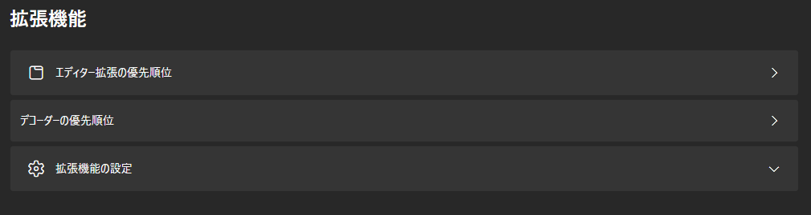
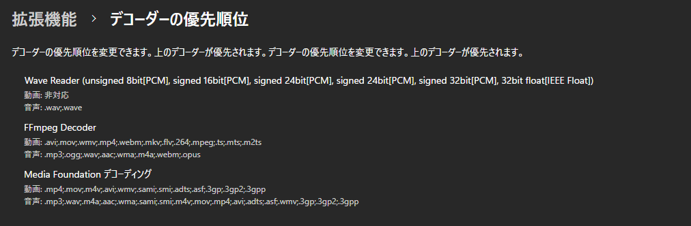
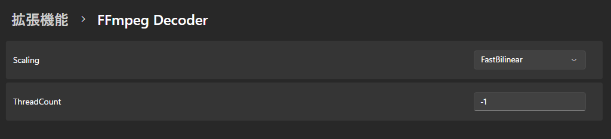
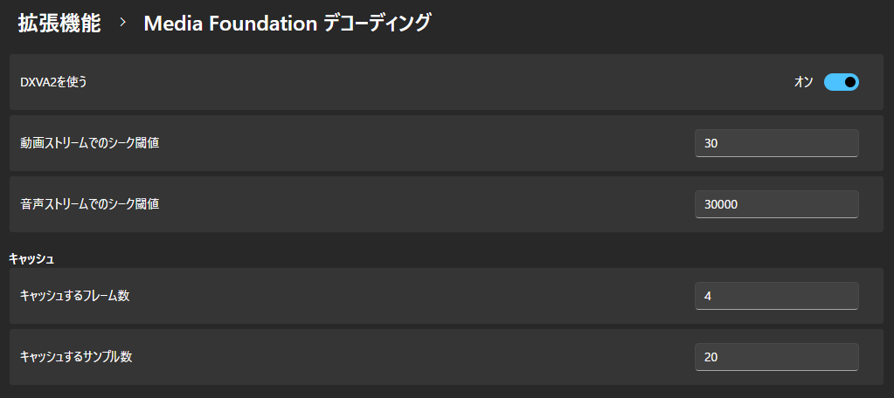

## Decoder Priority

Change the priority of decoders.
The decoder at the top of the list is given priority.

## Extension Settings

Change individual settings for extensions.

### FFmpeg Decoder

#### Scaling

Set the scaling algorithm.

For more details, see [here](https://ffmpeg.org/ffmpeg-scaler.html#toc-Scaler-Options).

- FastBilinear
- Bilinear
- Bicubic __(default value)__
- X
- Point
- Area
- Bicublin
- Gauss
- Sinc
- Lanczos
- Spline

#### ThreadCount

Set the number of threads to use for decoding.

If a value less than 0 is specified, the device's thread count (up to 16) is used.  
If 0 is specified, FFmpeg will automatically detect the number of threads.

The default value is __"-1"__.

### Media Foundation Decoding

#### Use DXVA2

Use DirectX Video Acceleration 2.0 to decode videos quickly.

The default setting is __"On"__.

#### Video Stream Seek Threshold

Seek when a frame farther than this frame count is loaded.

The default value is __"30"__.

#### Audio Stream Seek Threshold

Seek when a sample farther than this sample count is loaded.

The default value is __"30000"__.

#### Number of Frames to Cache

The default value is __"4"__.

#### Number of Samples to Cache

The default value is __"20"__.
