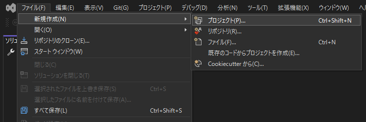
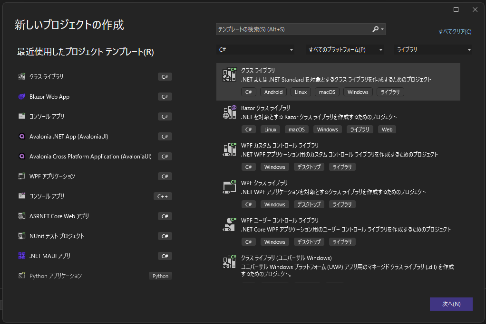
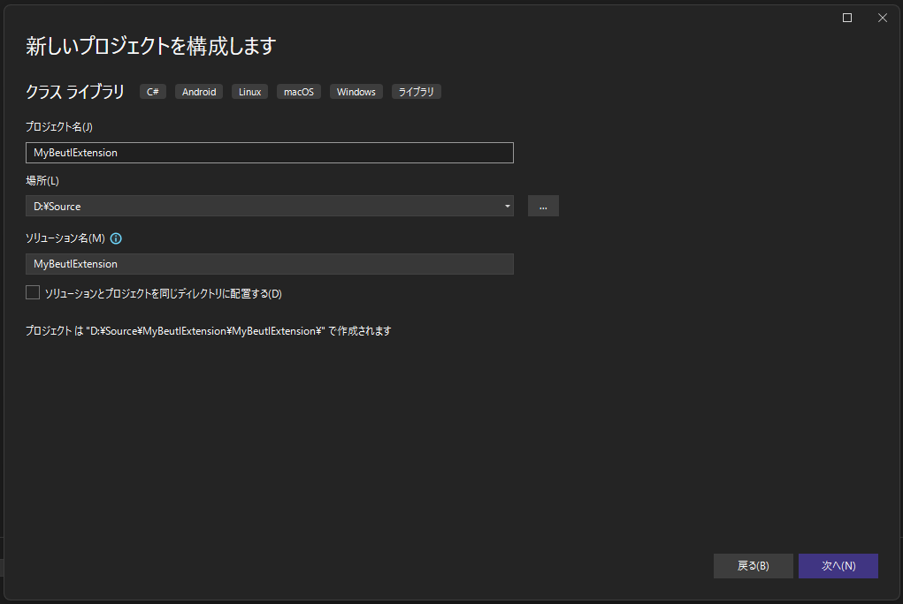
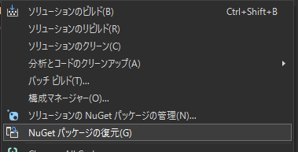

Beutl拡張機能用に空のC#プロジェクトを作成する方法を説明します。

この記事では、__Visual Studio Code__、__Visual Studio__ を使う方法を紹介します。
Beutl 2.0 では `Beutl.Extensibility.Sdk` という MSBuild SDK が用意されており、ターゲットフレームワーク・言語デフォルト・標準パッケージ参照（`Beutl.Extensibility`、`Beutl.ProjectSystem`、`Beutl.NodeGraph`、`Beutl.Editor`、`Beutl.Engine.SourceGenerators`）・サイドロード時の出力先を自動で設定してくれます。これを使うと csproj を最小構成で記述できます。

:::tip
ターゲットにする Beutl のリリースに合わせて SDK のバージョンを選択してください。SDK と Beutl ランタイムパッケージは同じバージョン体系で配布されます（例: `2.0.0-preview.7`）。別の組み合わせを使いたい場合は `BeutlPackagesVersion` プロパティで参照パッケージのバージョンを上書きできます。
:::

## Visual Studio Code
1. ターミナルを使用して、クラスライブラリを作成します。
```sh
dotnet new classlib -o MyBeutlExtension
```

ディレクトリ構造が以下のようになることをご確認ください。
```
MyBeutlExtension
┣━ obj
┃  ┗━ (...)
┣━ Class1.cs
┗━ MyBeutlExtension.csproj
```

2. 以下のコマンドを実行して、`nuget.config` を生成し、パッケージソースを追加します。Beutl の SDK とランタイムパッケージは `nuget.beditor.net` フィードから配布されています。
```sh
dotnet new nugetconfig
dotnet nuget add source "https://nuget.beditor.net/v3/index.json" --name nuget.beditor.net
```

3. 生成された `MyBeutlExtension.csproj` を以下のように編集します。
```xml
<Project Sdk="Beutl.Extensibility.Sdk/2.0.0-preview.7">
  <PropertyGroup>
    <PackageId>MyBeutlExtension</PackageId>
    <Title>拡張機能のサンプル</Title>
    <Description>サンプル</Description>
    <PackageTags>sample</PackageTags>
    <Version>1.0.0</Version>
    <Authors>作者名</Authors>
    <RepositoryUrl>url/to/repository</RepositoryUrl>

    <!-- Debug ビルド時に出力先を ~/.beutl/sideloads/<AssemblyName> にし、
         Beutl からサイドロード拡張機能として読み込めるようにします。 -->
    <DebugApplication Condition="'$(Configuration)'=='Debug'">true</DebugApplication>
  </PropertyGroup>
</Project>
```

SDK が以下を自動で行います。

- `TargetFramework` を `net10.0` に、`ImplicitUsings` と `Nullable` を `enable` に設定。
- `Beutl.Extensibility`、`Beutl.ProjectSystem`、`Beutl.NodeGraph`、`Beutl.Editor` への `PackageReference` と `Beutl.Engine.SourceGenerators` アナライザーを追加。
- `DebugApplication` が `true` のとき、出力先を `~/.beutl/sideloads/<AssemblyName>` にリダイレクト。

以上で拡張機能用に空のC#プロジェクトを作成することができました。

### 自動参照のカスタマイズ

特定の自動参照を無効化したい場合は、以下のプロパティを `false` に設定します。

- `BeutlAutoReferenceAll`
- `BeutlAutoReferenceExtensibility`
- `BeutlAutoReferenceProjectSystem`
- `BeutlAutoReferenceNodeGraph`
- `BeutlAutoReferenceEditor`
- `BeutlAutoReferenceSourceGenerators`

## Visual Studio
1. Visual Studio を開いて、__ファイル &gt; 新規作成 &gt; プロジェクト__ をクリックします。


2. クラスライブラリを選択して、次へをクリックします。


3. プロジェクト名、場所を入力して次へをクリックします。


4. フレームワークは `.NET 10.0` を選択します（`Beutl.Extensibility.Sdk` 側で上書きされますが、ターゲットの Beutl リリースに合わせておくと最初から IntelliSense が正しく機能します）。

5. 作成をクリックします。

ディレクトリ構造が以下のようになることをご確認ください。
```
MyBeutlExtension
┣━ MyBeutlExtension
┃  ┣━ obj
┃  ┃  ┗━ (...)
┃  ┣━ Class1.cs
┃  ┗━ MyBeutlExtension.csproj
┗━ MyBeutlExtension.sln
```

6. 以下のコマンドを実行して、`nuget.config` を生成し、パッケージソースを追加します。
```sh
dotnet new nugetconfig
dotnet nuget add source "https://nuget.beditor.net/v3/index.json" --name nuget.beditor.net
```

7. 生成された `MyBeutlExtension.csproj` を以下のように編集します。
```xml
<Project Sdk="Beutl.Extensibility.Sdk/2.0.0-preview.7">
  <PropertyGroup>
    <PackageId>MyBeutlExtension</PackageId>
    <Title>拡張機能のサンプル</Title>
    <Description>サンプル</Description>
    <PackageTags>sample</PackageTags>
    <Version>1.0.0</Version>
    <Authors>作者名</Authors>
    <RepositoryUrl>url/to/repository</RepositoryUrl>

    <DebugApplication Condition="'$(Configuration)'=='Debug'">true</DebugApplication>
  </PropertyGroup>
</Project>
```

8. __NuGetパッケージの復元__ をクリックして、正常にNuGet依存関係を復元できることをご確認ください。


以上で拡張機能用に空のC#プロジェクトを作成することができました。
