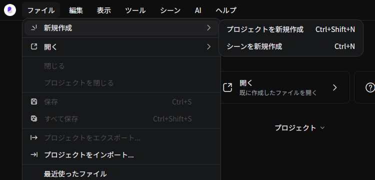
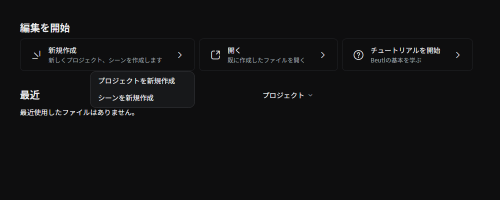
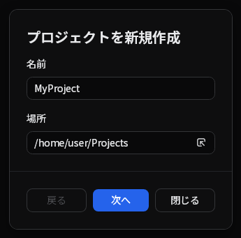
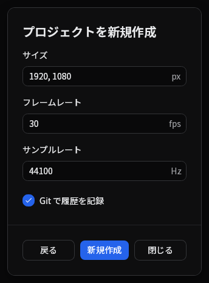

ウィンドウメニューの __ファイル > 新規作成 > プロジェクト__ または、  

スタートスクリーンの __新規作成 > プロジェクトを新規作成__ をクリックします。  

プロジェクトの名前と保存場所を指定します。  

__[次へ]__ をクリックします。  

フレームレートとサンプリングレート、初期シーンの横幅、高さを指定します。  
  
_Beutl では出力時にここで指定したサンプリングレートを使います。プレビュー再生時には使用しません。_

__[新規作成]__ をクリックするとプロジェクトを作成することができます。

Gitが利用できる場合は **Git で履歴を記録** を選択して、作成時からバージョン管理を開始できます。[バージョン管理](../reference/tool-tabs/version-control.md)を参照してください。

## 最近のプロジェクト

スタート画面の最近の一覧でプロジェクトを右クリックし、**ディスクから完全に削除** を選ぶと、ファイルを完全に削除できます。確認ダイアログには、専用のプロジェクトフォルダーとその内容を削除するのか、共有場所にあるプロジェクトファイルだけを削除するのかが表示されます。開いているプロジェクトは、閉じてから削除してください。

**削除** は最近の一覧から項目を取り除くだけで、ディスク上のファイルは残ります。

## ソース

- [`EditorHostFallback.axaml`](https://github.com/b-editor/beutl/blob/v2.0.0-preview.8/src/Beutl/Views/EditorHostFallback.axaml) / [`.axaml.cs`](https://github.com/b-editor/beutl/blob/v2.0.0-preview.8/src/Beutl/Views/EditorHostFallback.axaml.cs)
- [`ProjectDiskDeletion.cs`](https://github.com/b-editor/beutl/blob/v2.0.0-preview.8/src/Beutl/Services/ProjectDiskDeletion.cs)
