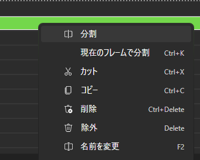

要素にエフェクトなどを追加したり、移動させたりする方法を説明します。

## 前提知識

このページでは __描画オブジェクト__ という用語を用いて説明します。
詳細は[こちら](../advanced/rendering-process.md)をご覧ください。

## エフェクトを追加
まずは追加したい要素をタイムライン上で選択します。
右側のプロパティエディターに選択している要素のプロパティが表示されます。

描画オブジェクトに直接エフェクトを追加する場合は、
__フィルタエフェクト__ の `+` ボタンをクリックして、追加したいエフェクトを選びます。  
<video controls muted playsInline title="" src="_images/5.edit-element/add-effect-in-property-editor.mp4" />

または、ライブラリから追加したいエフェクトを __フィルタエフェクト__ にドラッグアンドドロップすると追加できます。  
<video controls muted playsInline title="" src="_images/5.edit-element/add-effect-via-library.mp4" />

## トランスフォーム
トランスフォームを使用すると、移動、回転、スケール、歪みなどを表現できます。

描画オブジェクトに直接トランスフォームを設定する場合は、
__トランスフォーム__ の `+` ボタンをクリックして、追加したいトランスフォームの種類を選びます。

### プレビュー上でトランスフォームを編集

プレビューの **移動** ツールが有効で再生が停止しているとき、選択中のオブジェクトの周囲にトランスフォームハンドルが表示され、画面上で直接編集できます。

- **中央** をドラッグして位置を変更（`移動` トランスフォームを追加／更新）。
- **コーナーまたは辺** のハンドルをドラッグしてスケール（`スケール` トランスフォームを追加／更新）。
- コーナーの少し外側にある **回転** ハンドルをドラッグして回転（`回転` トランスフォームを追加／更新）。

ハンドルをドラッグすると、対応するトランスフォームがまだ無い場合は自動的に追加されます。フィルターエフェクトの中に追加したトランスフォームは、プレビューからは編集できません。

<video controls muted playsInline title="" src="_images/5.edit-element/add-transform.mp4" />

## 要素の時間を編集
タイムラインでマウスのドラッグ操作をすることで、
要素の開始時間、持続時間を編集することができます。

Beutlでは編集を簡単にするため、ドラッグ操作中に他のレイヤーの要素の時間にスナップします。
一時的に無効化するには `Alt` キーを押しながら、ドラッグ操作します。
この機能は、設定画面などで __永久的に無効化できません__ 。

<video controls muted playsInline title="" src="_images/5.edit-element/move-element.mp4" />

## 要素を分割
タイムラインで分割したい要素を右クリックして、メニューの分割ボタンをクリックすることで要素を分割できます。
`Ctrl + K` ショートカットを使うと、選択している要素を現在のフレームで分割できます。

## 要素の名前を変更
Beutlでは要素の色や名前を変えることができ、
それぞれ、右クリックメニューから変更できます。

名前は `F2` キーまたは、要素をダブルクリックで変更できます。

## 破損した要素の復旧

要素のデータが破損している場合や、必要な拡張機能がインストールされていない場合は、読み込めない部分が代替の要素やオブジェクトとして表示されます。読み取れない要素は無効になりますが、シーンの他の部分は引き続き編集できます。

必要な拡張機能をインストールし直すか、破損したファイルをバックアップから戻して、プロジェクトを開き直してください。復旧できていない部分の元のデータは、自動保存で上書きされないよう保護されます。

## ソース

- [`SceneRecovery.cs`](https://github.com/b-editor/beutl/blob/v2.0.0-preview.8/src/Beutl.ProjectSystem/ProjectSystem/SceneRecovery.cs)
