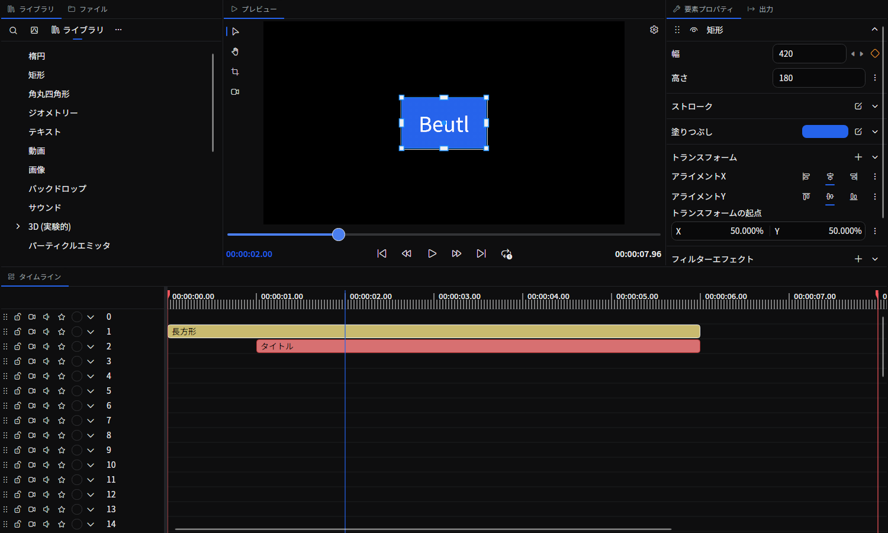

# ツールタブ

ツールタブは、シーンエディタの周囲にドッキングできる作業領域です。
タイムライン、ライブラリ、プロパティなど、それぞれのタブに役割があります。
タブをドラッグすると、配置を変えたり、複数のタブを重ねたり並べたりできます。

## タブの開き方とリセット

- 閉じているタブは、メニューバーの **「表示」→「ツール」** から開けます。
- ドックのタブヘッダにマウスを乗せると `+` ボタンが現れ、**そのドック** にタブを追加できます。すでに開いていて複数インスタンスを許可しないタブは、メニュー上で無効になります。
- タブのヘッダをドラッグすると、別のドック領域へ移動できます。
- **「表示」→「ドックレイアウトをリセット」** を選ぶと、タブの配置を初期状態に戻せます。
- 現在の配置に名前を付けて保存し、任意のシーンに適用するには [ドックレイアウト](./dock-layout.md) タブを使います。

「シーン設定」と「グラフエディタ」のタブは「表示」→「ツール」のメニューには表示されません。
開き方は、それぞれのページを参照してください。

- 選択中のタブにマウスを乗せると閉じるボタンが表示されます。タブ名の左には拡張機能のアイコンが表示されます。

## タブ一覧

| タブ | 概要 |
|------|------|
| [タイムライン](./timeline.md) | 要素を時間軸上で並べ替え・分割・グループ化する |
| [ライブラリ](./library.md) | 描画オブジェクトやエフェクトをドラッグして追加する |
| [ファイル](./file-browser.md) | プロジェクトフォルダや任意のフォルダのファイルを参照する |
| [要素プロパティ](./element-property.md) | 選択した要素そのもの（開始時刻・尺・色など）を編集する |
| [出力](./output.md) | エンコード設定と出力プロファイルを管理する |
| [シーン設定](./scene-settings.md) | シーンのサイズ・開始時間・長さ・レイヤー数を設定する |
| [グラフエディタ](./graph-editor.md) | アニメーションの時間カーブを編集する |
| [ノードグラフ](./node-graph.md) | ノードを配置・接続して処理の流れを編集する |
| [スコープ](./color-scopes.md) | 映像の波形・ヒストグラム・ベクトルスコープ・フォルスカラー・ゼブラを表示する |
| [カラーグレーディング](./color-grading.md) | 色調補正・カラーグレーディングを行う |
| [カーブ](./curves.md) | トーンカーブで色調を調整する |
| [オーディオビジュアライザー](./audio-visualizer.md) | 音声の波形・スペクトラム・レベルメーター・スペクトログラム・位相スコープを表示する |
| [パスエディタ](./path-editor.md) | パス図形の制御点を編集する |
| [プレビュー設定](./preview-settings.md) | プレビュー解像度・オニオンスキン・レンダーキャッシュを設定する |
| [履歴](./history.md) | 編集履歴を一覧表示し、任意のステップへ戻る |
| [ターミナル](./terminal.md) | エディターを離れずにプロジェクトフォルダーでシェルを実行する |
| [プロキシ](./proxies.md) | プレビューを軽快にする低解像度プロキシメディアを生成・管理する |
| [ドックレイアウト](./dock-layout.md) | タブの配置に名前を付けて保存し、任意のシーンに適用する |
| [バージョン管理](./version-control.md) | Gitでプロジェクトのバージョンを記録・比較・復元する |
| [ブラウザ](./web-browser.md) | Webサイトを閲覧し、プロジェクト用の素材をダウンロードする |
| [AI](./ai-workspace.md) | 画像・動画の生成と編集、字幕生成、ジョブの管理を行う |

このドキュメントの情報源は、[Beutl リポジトリ](https://github.com/b-editor/beutl)の `src/Beutl/Services/StartupTasks/LoadPrimitiveExtensionTask.cs` および `src/Beutl.Editor.Components/` 配下の `*TabExtension.cs` です。
