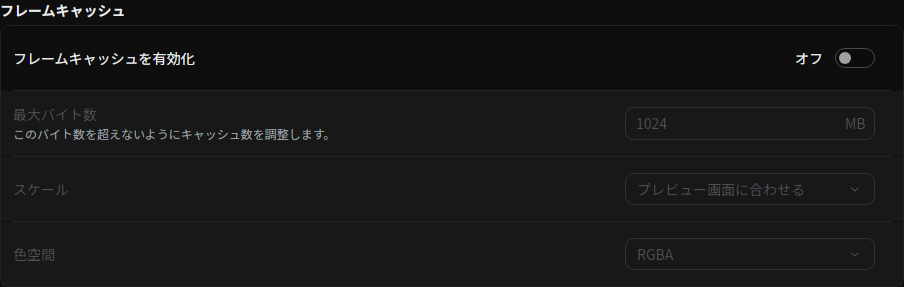

## 自動でシーンの長さを調整

オンにすると、要素を追加したとき、シーンの長さを調整する必要がある場合、自動で調整します。

## 自動保存

編集内容は変更の確定後に自動で保存されます。自動保存は常に有効で、以前の **自動保存を有効化** スイッチは削除されました。

完全に復元できなかった要素ファイルの保護については、[要素の編集](../get-started/edit-element.md#破損した要素の復旧)を参照してください。

## 正確な境界線を表示

オンにすると、プレビュー時に表示される境界を正確に表示します。

四角形などのオブジェクトは、境界線と描画内容が被さるため、境界線が見えなくなります。

## フレームキャッシュ

### フレームキャッシュを有効化

オンにすると、フレームキャッシュが有効になります。

デフォルト値は __"オフ"__ です。

### 最大バイト数

このバイト数 (メガバイト数) を超えないようにキャッシュ数を調整します。

デフォルト値はデバイスのメモリ容量の半分です。

### スケール

キャッシュをメモリに保存するとき、メモリ容量を節約するため、この設定を使用して解像度を下げます。

- オリジナル
- プレビュー画面に合わせる __(デフォルト値)__
- 二分の一
- 四分の一

:::tip
:::
  プレビュー画面のサイズがオリジナルサイズ以上の場合、解像度はそのままになります。

### 色空間

キャッシュをメモリに保存するとき、メモリ容量を節約するため、この設定を使用して色空間を変更します。

- RGBA __(デフォルト値)__
- YUV

:::tip
YUVはI420を使用します。
:::

## ノードキャッシュ

### ノードキャッシュを有効化

オンにすると、ノードキャッシュが有効になります。

デフォルト値は __"オフ"__ です。

### 最大ピクセル数

このピクセル数を超えるノードはキャッシュされません。

デフォルト値は __"1000000"__ です。

### 最少ピクセル数

このピクセル数未満のノードはキャッシュされません。

デフォルト値は __"1"__ です。

## プロキシメディア

ここでは、[プロキシメディアワークフロー](../reference/tool-tabs/proxies.md)に関する設定を変更できます。

### プレビューソース

プレビューでプロキシメディアを使用するかどうかを設定します。

- プロキシ優先 __(デフォルト値)__
- オリジナル強制

### 保存場所

プロキシファイルは、このフォルダーに保存されます。

既定の保存先は、Beutlのホームディレクトリ内にある `proxies` フォルダーです。変更はBeutlの再起動後に反映されます。

### 最大ストアサイズ

ストアがこのサイズ (GiB) を超えると、Beutlが最も使われていないプロキシから削除します。

デフォルト値は __"50"__ GiB です (設定可能範囲: 5〜500)。変更はBeutlの再起動後に反映されます。

### 既定のプリセット

プロキシツールタブで最初に選択される品質プリセットを設定します。

- プロキシ 1/2
- プロキシ 1/4 __(デフォルト値)__
- プロキシ 1/8

## プロパティエディター

### ポインターロックを有効化

プロパティエディターのドラッグ操作中にカーソルを非表示にして、固定します。(Windowsのみ)

デフォルト値は __"オン"__ です。

## ソース

- [`EditorConfig.cs`](https://github.com/b-editor/beutl/blob/v2.0.0-preview.8/src/Beutl.Configuration/EditorConfig.cs)
- [`EditViewModel.cs`](https://github.com/b-editor/beutl/blob/v2.0.0-preview.8/src/Beutl/ViewModels/EditViewModel.cs)
- [`AutoSaveService.cs`](https://github.com/b-editor/beutl/blob/v2.0.0-preview.8/src/Beutl.Editor/AutoSaveService.cs)
