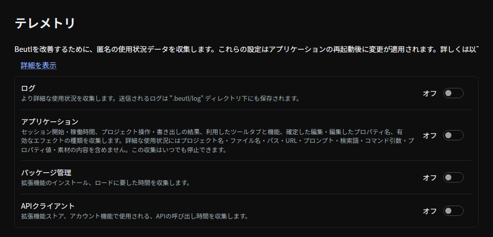

**設定 → テレメトリ** で、Beutlが収集する情報を選択できます。

## アプリケーション

**アプリケーション** スイッチで、デスクトップの詳細な使用状況の収集を設定します。セッション開始・稼働時間、プロジェクト操作・書き出しの結果、利用したツールタブと機能、確定した編集・編集したプロパティ名、有効なエフェクトの種類が対象です。

詳細な使用状況にはプロジェクト名・ファイル名・パス・URL・プロンプト・検索語・コマンド引数・プロパティ値・素材の内容を含めません。**アプリケーション** をオフにすると、いつでもこの収集を停止できます。

## ログ

**ログ** を有効にすると、アプリケーション・パッケージ管理・APIクライアントのテレメトリスイッチも有効になります。個別に無効にする場合は、先にログをオフにしてください。

## ソース

- [`TelemetrySettingsPage.axaml`](https://github.com/b-editor/beutl/blob/v2.0.0-preview.8/src/Beutl/Pages/SettingsPages/TelemetrySettingsPage.axaml)
- [`TelemetrySettingsPageViewModel.cs`](https://github.com/b-editor/beutl/blob/v2.0.0-preview.8/src/Beutl/ViewModels/SettingsPages/TelemetrySettingsPageViewModel.cs)
- [`UsageTelemetry.cs`](https://github.com/b-editor/beutl/blob/v2.0.0-preview.8/src/Beutl.Editor/Services/UsageTelemetry.cs)
- [`SettingsStrings.ja.resx`](https://github.com/b-editor/beutl/blob/v2.0.0-preview.8/src/Beutl.Language/SettingsStrings.ja.resx)
