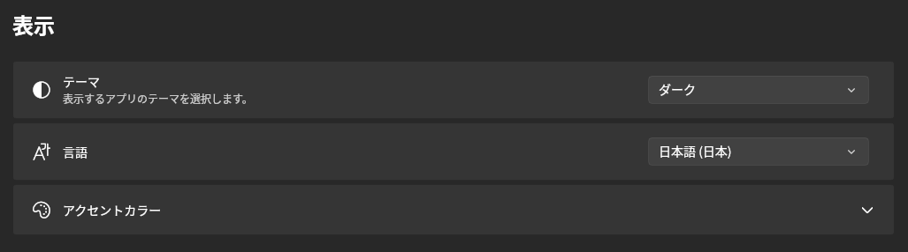

## テーマ

- **ダーク** — Beutl 独自のニアブラックのデザイン。既定値です。
- **ダーク (クラシック)** — **ダーク** が上に重ねているデザイン用の上書きを適用しない、素のダークテーマ。
- **ライト**
- **ハイコントラスト**
- **システムに従う**

テーマは独自のアクセントカラーを持つことができ、[アクセントカラー](#アクセントカラー) を自分で設定していない場合はそちらが使われます。**ダーク** は青系のアクセント（`#2563EB`）を使い、その他の組み込みテーマはアクセントを OS に任せます。

拡張機能から独自のテーマを追加することもでき、登録されたテーマは組み込みのテーマと並んでこの一覧に表示されます。[開発可能な拡張機能](../extensions/available-extensions.md) を参照してください。

:::note
Beutl 1.x の設定は自動的に移行されます。**ライト**・**ハイコントラスト**・**システムに従う** を選んでいた場合はそのテーマが引き継がれ、以前の既定値のままだった場合は新しい **ダーク** のデザインテーマになります。
:::

## 言語

- 日本語
- 英語

## アクセントカラー

任意の色を設定できます。

