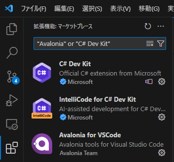
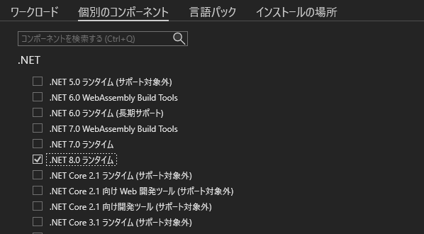
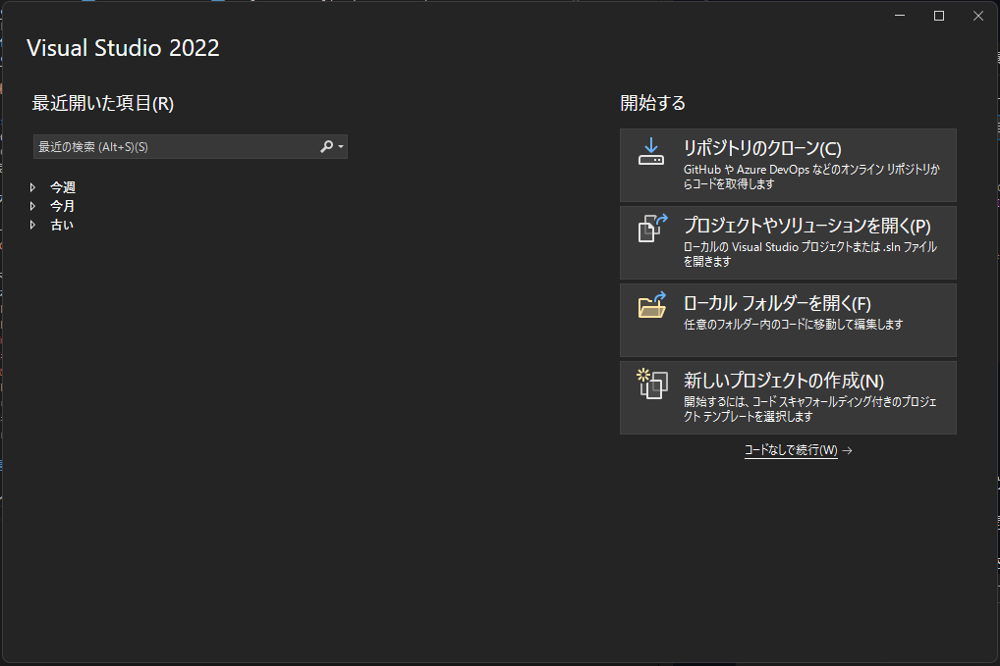
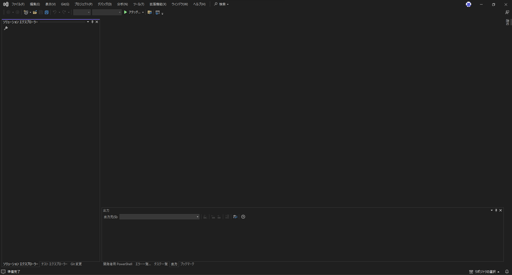
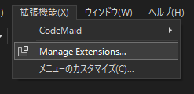
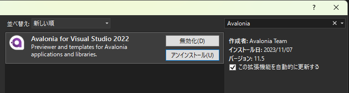

Beutlの拡張機能を開発するうえで必要な開発環境を構築する方法を説明します。

この記事では、__Visual Studio Code__ または __Visual Studio__ を使う方法を紹介します。

## Visual Studio Code

### インストール
1. [.NET SDK](https://dotnet.microsoft.com/ja-jp/download) をインストールします。  
> [!TIP]
> 対象とするBeutlのバージョンに応じて、.NET SDKのバージョンを選択してください。  
> [バージョンの対応表](version-mapping.md)

2. [このページ](https://code.visualstudio.com/Download)から、お使いの開発環境に、__Visual Studio Code__ をインストールします。

### Visual Studio Code に拡張機能をインストール
3. インストールした __Visual Studio Code__ に [C# Dev Kit](https://marketplace.visualstudio.com/items?itemName=ms-dotnettools.csdevkit) をインストールします。
> [!TIP]
> UIを使用した拡張機能を開発する場合、[Avalonia for VSCode](https://marketplace.visualstudio.com/items?itemName=AvaloniaTeam.vscode-avalonia)をインストールしてください。

## Visual Studio
_Windowsのみ_

### インストール
1. [このページ](https://visualstudio.microsoft.com/ja/vs/)から、__Visual Studio__ をダウンロードします。

2. ダウンロードしたインストーラーを開きます。

3. ワークロードを選択する画面が表示されたら、個別のコンポーネントを開きます。

4. 以下のコンポーネントを選択します。  
   (これは最小構成です。必要に応じて追加してください。)
  - `.NET 10.0 ランタイム`
  - `.NET SDK`
  - `NuGet パッケージ マネージャー`
  - `C# および Visual Basic Roslyn コンパイラ`
  - `MSBuild`
  - `.NET プロファイル ツール`
  - `Just-In-Time デバッガー`
  - `C# および Visual Basic`
  - `InteliCode`

5. __言語パック__、__インストールの場所__ を設定した後、インストールをクリックします。

### Visual Studio に拡張機能をインストール

_この項はUIを使った拡張機能を開発しない場合、無視していただいても構いません_

6. インストール後、以下のようなスタートウィンドウが開きます。

右下の __コード無しで続行__ をクリックして、以下のウィンドウを開いてください。

7. 上部のメニューから __拡張機能 &gt; 拡張機能の管理__ をクリックします。

8. 表示されたウィンドウから、__Avalonia for Visual Studio 2022__ をインストールします。

----

以上で環境構築が完了しました。  
何か問題が発生した場合、__Visual Studio Code__、__Visual Studio__ の公式ドキュメントをご覧ください。
- [Visual Stucio Code](https://code.visualstudio.com/docs/setup/setup-overview)
- [Visual Studio](https://learn.microsoft.com/ja-jp/visualstudio/install/install-visual-studio?view=vs-2022)