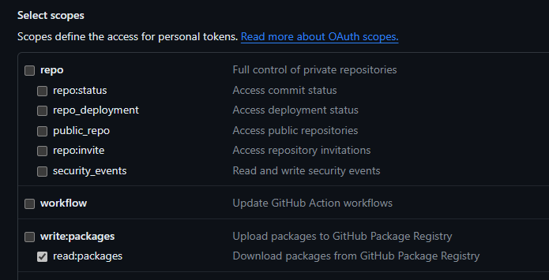
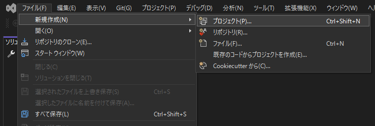
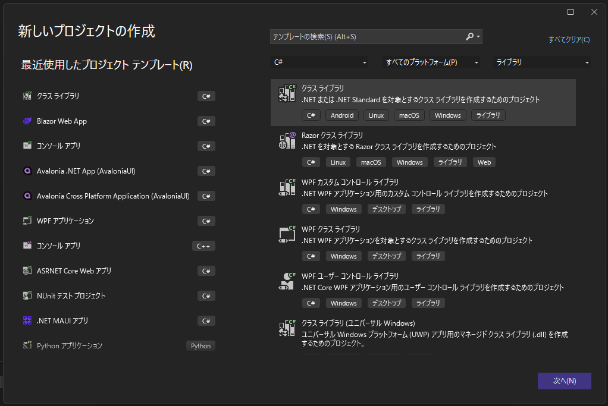
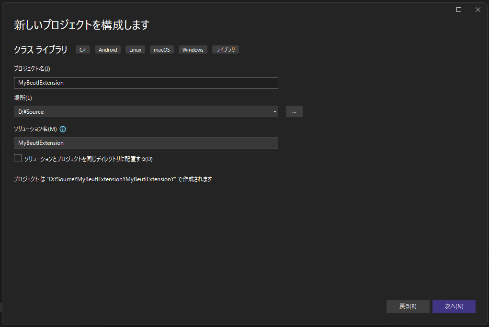
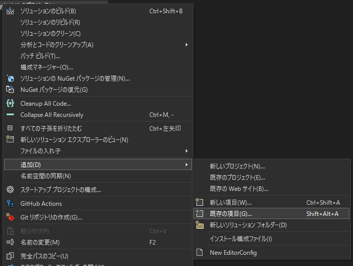
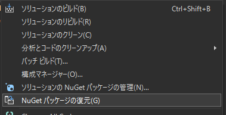

Beutl拡張機能用に空のC#プロジェクトを作成する方法を説明します。

この記事では、__Visual Studio Code__、__Visual Studio__ を使う方法を紹介します。
また、対象とするBeutlのバージョンは`1.0.0-preview.5`とします。

## Visual Studio Code
1. ターミナルを使用して、クラスライブラリを作成します。  
```sh
dotnet new classlib -o MyBeutlExtension
```

ディレクトリ構造が以下のようになることをご確認ください。
```
MyBeutlExtension
┣━ obj
┃  ┗━ (...)
┣━ Class1.cs
┗━ MyBeutlExtension.csproj
```

2. 生成された `MyBeutlExtension.csproj` を以下のように編集します。
```xml
<Project Sdk="Microsoft.NET.Sdk">
  <PropertyGroup>
    <!-- TargetFrameworkはBeutlのバージョンに応じて変更してください -->
    <TargetFramework>net8.0</TargetFramework>
    <ImplicitUsings>enable</ImplicitUsings>
    <Nullable>enable</Nullable>

    <!-- 以下は任意です。 -->
    <RepositoryUrl>url/to/repository</RepositoryUrl>
    <PackageId>MyBeutlExtension</PackageId>
    <Title>拡張機能のサンプル</Title>
    <Description>サンプル</Description>
    <PackageTags>sample</PackageTags>
    <Version>1.0.0</Version>
    <AssemblyVersion>1.0.0.0</AssemblyVersion>
    <Authors>作者名</Authors>
  </PropertyGroup>

  <!-- ビルドしたときに、サイドロード拡張機能として認識されるようにする。 -->
  <PropertyGroup Condition="'$(Configuration)'=='Debug'">
    <AppendTargetFrameworkToOutputPath>false</AppendTargetFrameworkToOutputPath>
    <AppendRuntimeIdentifierToOutputPath>false</AppendRuntimeIdentifierToOutputPath>
    <EnableDynamicLoading>true</EnableDynamicLoading>
    <OutputPath>$([System.Environment]::GetFolderPath(SpecialFolder.UserProfile))\.beutl\sideloads\$(AssemblyName)</OutputPath>
  </PropertyGroup>

  <ItemGroup>
    <PackageReference Include="Beutl.Sdk" Version="1.0.0-preview.5" />
  </ItemGroup>

</Project>
```

3. nuget.configを生成します。
```sh
dotnet new nugetconfig
```

### GitHubアカウントを持っている場合

1. お使いのGitHubアカウントから __Personal access tokens__ を生成します。  
   スコープは `read:packages` のみを設定します。  


2. 以下のコマンドを実行して、生成された `nuget.config` にパッケージソースを追加します。
```sh
dotnet nuget add source "https://nuget.pkg.github.com/b-editor/index.json" \
    --name github-beutl \
    --username $あなたのGitHubユーザー名 \
    --password $上で生成したPersonalAccessToken \
    --store-password-in-clear-text
```
> [!WARNING]
> Gitでバージョン管理をしている場合、`.gitignore`ファイルを使って `nuget.config` を除外することを忘れないでください。

### GitHubアカウントを持っていない場合

1. `.nuget` ディレクトリを作成します。

2. [リリース](https://github.com/b-editor/beutl/releases)から `Beutl.Sdk.1.0.0-preview.5.nupkg` ファイルをダウンロードして、`.nuget`ディレクトリに配置します。

3. 以下のコマンドを実行して、生成された `nuget.config` にパッケージソースを追加します。
```sh
dotnet nuget add source .nuget -n ローカルソース
```

----
4. 以下のコマンドを実行して、正常にNuGet依存関係を復元できることをご確認ください。
```sh
dotnet restore
```

以上で拡張機能用に空のC#プロジェクトを作成することができました。

## Visual Studio
1. Visual Studio を開いて、__ファイル &gt; 新規作成 &gt; プロジェクト__ をクリックします。  


2. クラスライブラリを選択して、次へをクリックします。  


3. プロジェクト名、場所を入力して次へをクリックします。


4. フレームワークはBeutlのバージョンに応じて選択してください。

5. 作成をクリックします。

ディレクトリ構造が以下のようになることをご確認ください。
```
MyBeutlExtension
┣━ MyBeutlExtension
┃  ┣━ obj
┃  ┃  ┗━ (...)
┃  ┣━ Class1.cs
┃  ┗━ MyBeutlExtension.csproj
┗━ MyBeutlExtension.sln
```

2. 生成された `MyBeutlExtension.csproj` を以下のように編集します。
```xml
<Project Sdk="Microsoft.NET.Sdk">
  <PropertyGroup>
    <!-- TargetFrameworkはBeutlのバージョンに応じて変更してください -->
    <TargetFramework>net8.0</TargetFramework>
    <ImplicitUsings>enable</ImplicitUsings>
    <Nullable>enable</Nullable>

    <!-- 以下は任意です。 -->
    <RepositoryUrl>url/to/repository</RepositoryUrl>
    <PackageId>MyBeutlExtension</PackageId>
    <Title>拡張機能のサンプル</Title>
    <Description>サンプル</Description>
    <PackageTags>sample</PackageTags>
    <Version>1.0.0</Version>
    <AssemblyVersion>1.0.0.0</AssemblyVersion>
    <Authors>作者名</Authors>
  </PropertyGroup>

  <!-- ビルドしたときに、サイドロード拡張機能として認識されるようにする。 -->
  <PropertyGroup Condition="'$(Configuration)'=='Debug'">
    <AppendTargetFrameworkToOutputPath>false</AppendTargetFrameworkToOutputPath>
    <AppendRuntimeIdentifierToOutputPath>false</AppendRuntimeIdentifierToOutputPath>
    <EnableDynamicLoading>true</EnableDynamicLoading>
    <OutputPath>$([System.Environment]::GetFolderPath(SpecialFolder.UserProfile))\.beutl\sideloads\$(AssemblyName)</OutputPath>
  </PropertyGroup>

  <ItemGroup>
    <PackageReference Include="Beutl.Sdk" Version="1.0.0-preview.5" />
  </ItemGroup>

</Project>
```

### GitHubアカウントを持っている場合

1. お使いのGitHubアカウントから __Personal access tokens__ を生成します。  
   スコープは `read:packages` のみを設定します。


2. 以下のコマンドを実行して、`nuget.config` を生成し、パッケージソースを追加します。
```sh
dotnet new nugetconfig

dotnet nuget add source "https://nuget.pkg.github.com/b-editor/index.json" \
    --name github-beutl \
    --username $あなたのGitHubユーザー名 \
    --password $上で生成したPersonalAccessToken \
    --store-password-in-clear-text
```
> [!WARNING]
> Gitでバージョン管理をしている場合、`.gitignore`ファイルを使って `nuget.config` を除外することを忘れないでください。

### GitHubアカウントを持っていない場合

1. `.nuget` ディレクトリを作成します。

2. [リリース](https://github.com/b-editor/beutl/releases)から `Beutl.Sdk.1.0.0-preview.5.nupkg` ファイルをダウンロードして、`.nuget`ディレクトリに配置します。

3. 以下のコマンドを実行して、`nuget.config` を生成し、パッケージソースを追加します。
```sh
cd .nuget

dotnet new nugetconfig

dotnet nuget add source ./ -n ローカルソース
```

4. ソリューションに　`nuget.config` を追加します。  


----
3. __NuGetパッケージの復元__ をクリックして、正常にNuGet依存関係を復元できることをご確認ください。  


以上で拡張機能用に空のC#プロジェクトを作成することができました。
