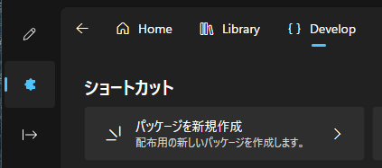
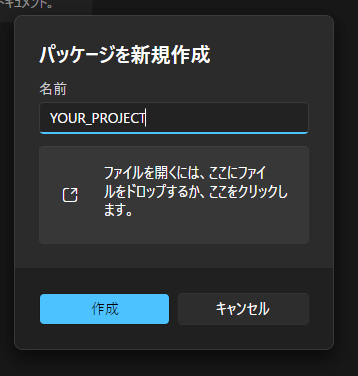
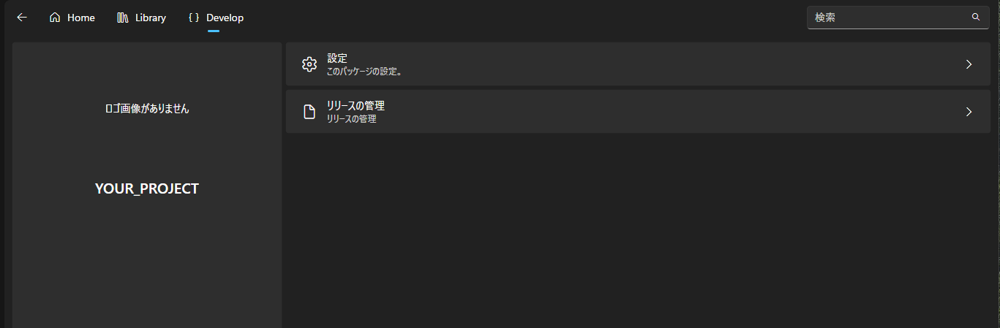
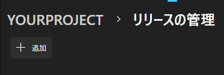
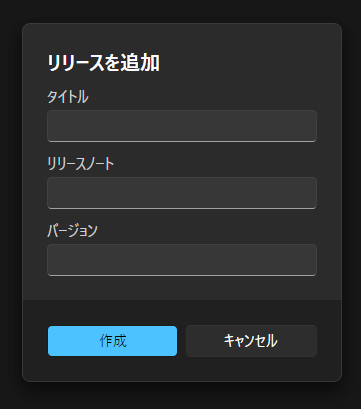
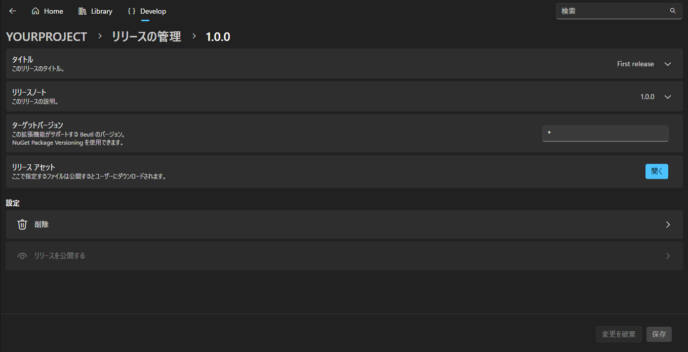
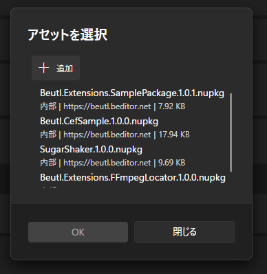
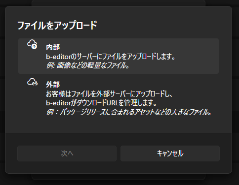
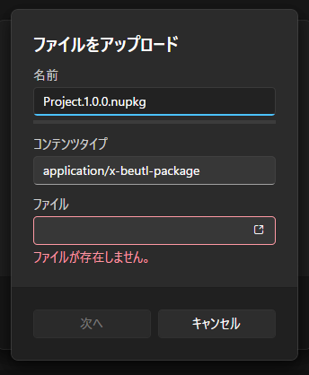

Beutlの拡張機能をストアに公開する方法を説明します。

_ここでは、C#プロジェクトの名前を`YOUR_PROJECT`としています。_

## NuGetパッケージを作成
`YOUR_PROJECT.csproj`があるディレクトリで以下のコマンドを実行します。
```sh
dotnet pack -c Release
```

実行すると以下のように`YOUR_PROJECT.1.0.0.nupkg`ファイルが生成されます。
```
YOUR_PROJECT
┣━ YOUR_PROJECT.csproj
┗━ bin
    ┗━ Release
        ┗━ YOUR_PROJECT.1.0.0.nupkg
```

## パッケージを新規作成
1. 右側のナビゲーションから拡張機能を開きます。

2. Developページを開いて `パッケージを新規作成` をクリックします。  


3. `YOUR_PROJECT` と入力します。

4. __[作成]__ をクリックします。

> [!TIP]
> ファイルを選択するとnupkgファイルやnuspecファイルからタイトルや説明を自動入力できます。


## リリースを作成
> [!TIP]
> 前項でnupkgファイルやnuspecファイルを選択して、パッケージを作成した場合、
> 自動でリリースが作成されます。

1. __[リリースの管理]__ をクリックします。  


2. __[追加]__ をクリックします。  


4. タイトル、内容、バージョンを入力します。
   バージョンはNuGetパッケージのバージョンと同じにします。


5. __[作成]__ をクリックします。

## アップロード
1. __[リリースの管理]__ をクリックします。

2. 任意のリリースをクリックしてください。

3. __リリース アセット__ の __[開く]__ をクリックします。


4. アセットを選択するダイアログが表示されます。


5. __[追加]__ をクリックします。

6. 今回はBeutlのサーバーにアップロードするため、内部をクリックします
   （外部を選ぶとGitHubなどのURLとファイルのハッシュ値を指定できます）


5. ファイル名を入力します。

6. アップロードするファイルを選択します。


7. 次へをクリックするとアップロードされます。

8. ダイアログを閉じます。

9. 右下の保存をクリックします

10. __[公開する]__ をクリックします。
   （最終的にユーザーがダウンロードできるようにするにはパッケージ側の公開設定を変更する必要があります）

## パッケージを公開
1. __拡張機能 > Develop__ から公開したいパッケージの __[編集]__ をクリックします。

2. 設定を開きます

3. __[パッケージを公開]__ をクリックします。
