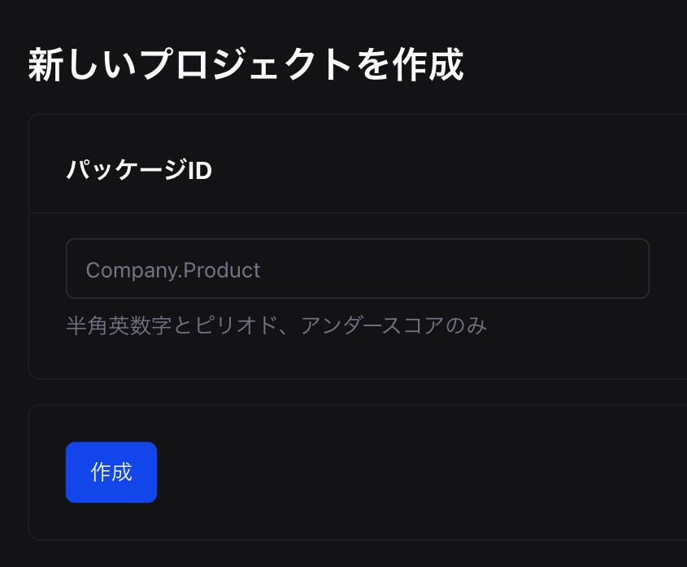
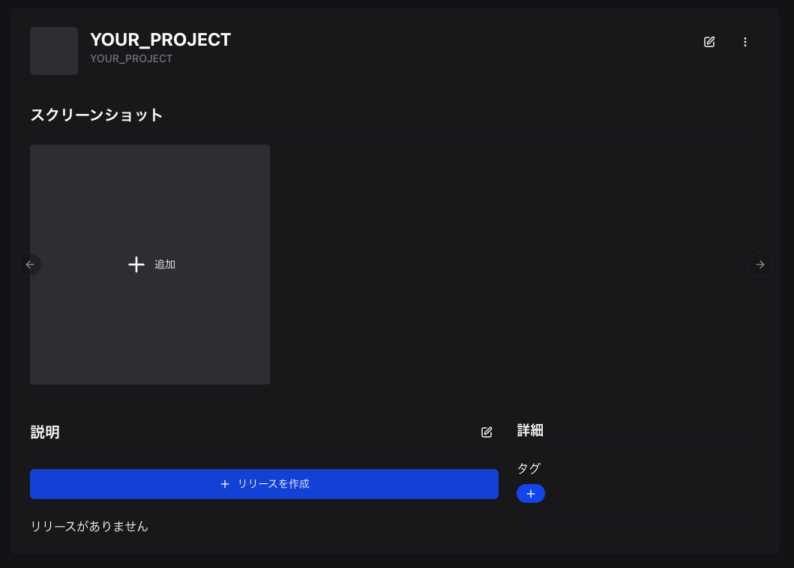
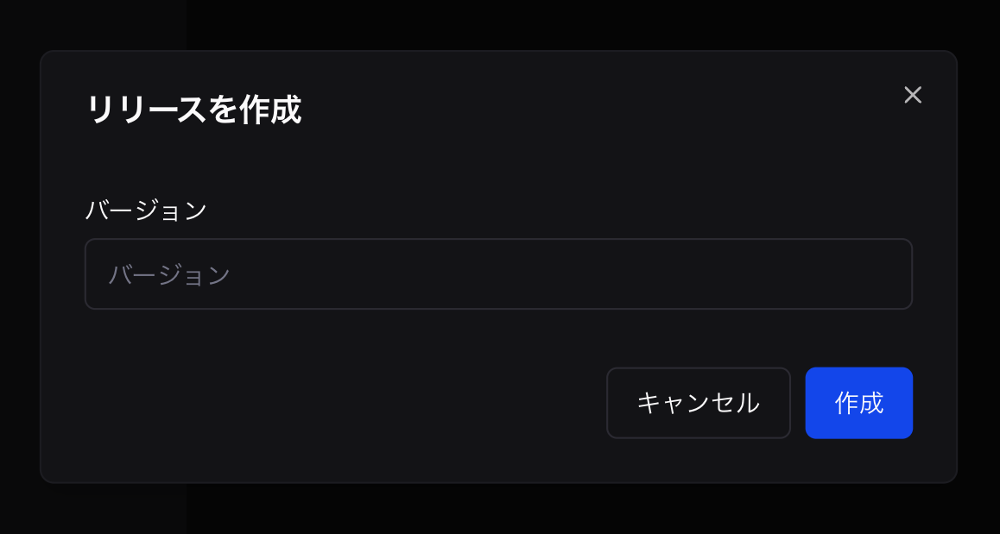
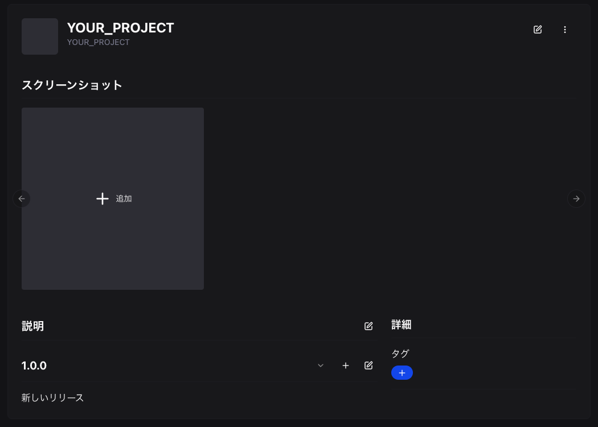
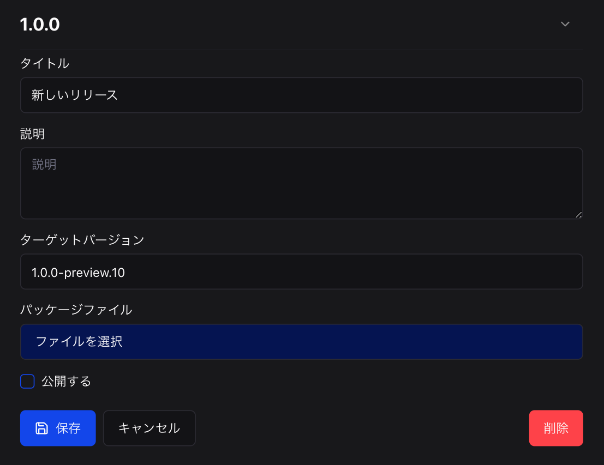
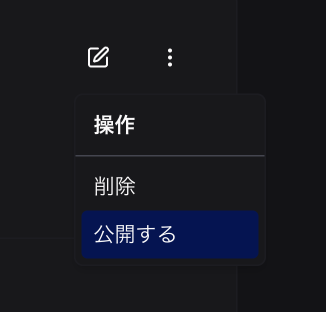

Beutlの拡張機能をストアに公開する方法を説明します。

_ここでは、C#プロジェクトの名前を`YOUR_PROJECT`としています。_

## NuGetパッケージを作成
`YOUR_PROJECT.csproj`があるディレクトリで以下のコマンドを実行します。
```sh
dotnet pack -c Release
```

実行すると以下のように`YOUR_PROJECT.1.0.0.nupkg`ファイルが生成されます。
```
YOUR_PROJECT
┣━ YOUR_PROJECT.csproj
┗━ bin
    ┗━ Release
        ┗━ YOUR_PROJECT.1.0.0.nupkg
```

## パッケージを新規作成
1. [デベロッパー](https://beutl.beditor.net/ja/developer)にアクセスします。
2. サインインしていない場合はサインインします。
3. __[新しい拡張機能を作成]__ をクリックします。
   
4. パッケージID (ここでは、YOUR_PROJECT) を入力します。
5. __[作成]__ をクリックします。
   

## リリースを作成

1. __[リリースを作成]__ をクリックします。
   
2. バージョンを入力します。
   
3. __[作成]__ をクリックします。
4. リリースが作成されます。
   
5. 編集ボタンをクリックします。
6. __[ファイルを選択]__ をクリックします。
   
7. `YOUR_PROJECT.1.0.0.nupkg` を選択します。

8. __[公開する]__ をクリックします。
   （最終的にユーザーがダウンロードできるようにするにはパッケージ側の公開設定を変更する必要があります）
9. __[保存]__ をクリックします。

## パッケージを公開


__[公開する]__ をクリックします。
