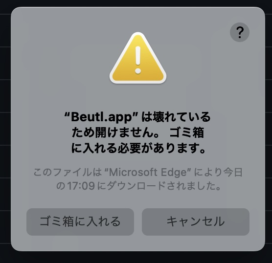

Beutlをインストールする方法を説明します。

このドキュメントではインストールするBeutlのバージョンを`{version}`としています。

## 最初に
[.NET 8](https://dotnet.microsoft.com/ja-jp/download/dotnet/8.0)をインストールします。

> [!TIP]
> インストールするBeutlのバージョンに応じて.NETのバージョンを決定してください。  
> [バージョンの対応表](../extensions/version-mapping.md)

## Windowsの場合

### インストーラーを使う
1. `beutl-setup.exe`をダウンロードして、実行します。
2. 画面に従ってインストールします。
3. [FFmpegの配置](../ffmpeg-install.md)を参考にして、FFmpegをインストールします。
4. `Beutl.exe`を起動します。

### 手動でインストール
1. `beutl-win-x64-{version}.zip`をダウンロードして、展開します。
2. [FFmpegの配置](../ffmpeg-install.md)を参考にして、FFmpegをインストールします。
3. `Beutl.exe`を起動します。

## Ubuntu22.04の場合

### Debianパッケージからインストール

> [!TIP]
> この方法は`1.0.0-preview.5`から利用可能です。

1. `beutl_1.0.0-285ubuntu22.04_amd64.deb`をダウンロードします。
2. 以下のコマンドを実行します。
```sh
sudo apt update
sudo apt install ./beutl_1.0.0-285ubuntu22.04_amd64.deb
```
3. インストール完了です

### 手動でインストール
1. `beutl-linux-x64-{version}.zip`をダウンロードして、展開します。
2. [FFmpegの配置](ffmpeg-install.md)を参考にして、FFmpegをインストールします。
3. `chmod`を使用して、`Beutl`, `Beutl.ExceptionHandler`, `Beutl.PackageTools`, `Beutl.WaitingDialog`を実行可能にします。
4. `Beutl`を起動します。

> [!IMPORTANT]
> `1.0.0-preview.5`未満をインストールする場合、
> [こちら](https://github.com/shimat/opencvsharp#ubuntu)を参考に `libOpenCvSharpExtern` をビルドしてください。

## macOSの場合

`Beutl.osx_arm64.app.zip` または `Beutl.osx_x64.app.zip` をダウンロードして、展開します。
以下のような警告が出るはずです。


これは私がアプリケーションに署名をしていないために、表示される警告です。
これを回避するには以下のコマンドを実行してください。
```sh
xattr -rc Beutl.app
```

