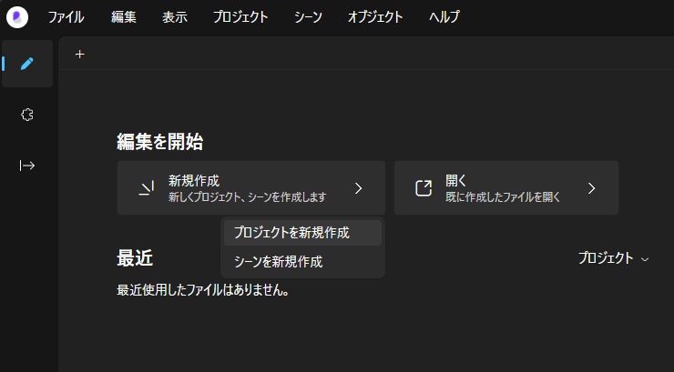
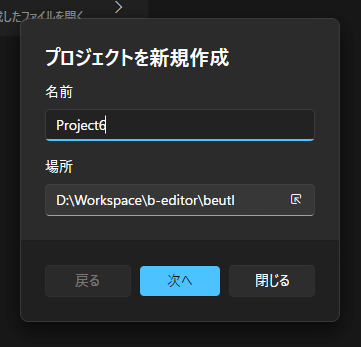
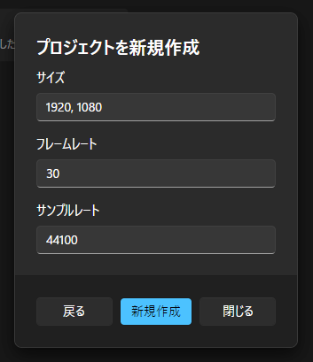

## プロジェクトを作成する

ウィンドウメニューの __ファイル > 新規作成 > プロジェクト__ または、  

スタートスクリーンの __新規作成 > プロジェクトを新規作成__ をクリックします。  

プロジェクトの名前と保存場所を指定します。  

__[次へ]__ をクリックします。  

フレームレートとサンプリングレート、初期シーンの横幅、高さを指定します。  
  
_Beutl では出力時にここで指定したサンプリングレートを使います。プレビュー再生時には使用しません。_

__[新規作成]__ をクリックするとプロジェクトを作成することができます。
