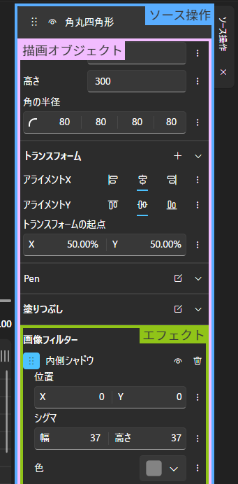
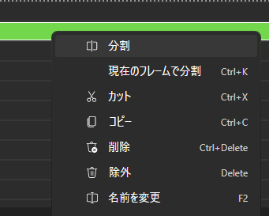

## 要素の編集
要素にエフェクトなどを追加したり、移動させたりする方法を説明します。

### 前提知識

このページでは __ソース操作__ __描画オブジェクト__ などを用語を用いて説明します。
詳細は[こちら](../advanced/1.rendering-process.md)をご覧ください。

UI上での見分け方

</img>

## エフェクトを追加
まずは追加したい要素をタイムライン上で選択します。
右側のタブの __ソース操作__ に選択している要素のプロパティが表示されます。

描画オブジェクトに直接エフェクトを追加する場合は、
__フィルタエフェクト__ の `+` ボタンをクリックして、追加したいエフェクトを選びます。  

または、ライブラリから追加したいエフェクトを __フィルタエフェクト__ にドラッグアンドドロップすると追加できます。  

それ以外の場所にドラッグアンドドロップすると、ソース操作としてエフェクトを追加することができます。  

## トランスフォーム
トランスフォームを使用すると、移動、回転、スケール、歪みなどを表現できます。

描画オブジェクトに直接トランスフォームを設定する場合は、
__トランスフォーム__ の `+` ボタンをクリックして、追加したいトランスフォームの種類を選びます。

移動トランスフォームの場合のみ、プレビュー画面からマウスで移動することができます。
しかし、エフェクト (またはソース操作) として追加した移動トランスフォームはマウスで移動できません。

## 要素の時間を編集
タイムラインでマウスのドラッグ操作をすることで、
要素の開始時間、持続時間を編集することができます。

Beutlでは編集を簡単にするため、ドラッグ操作中に他のレイヤーの要素の時間にスナップします。
一時的に無効化するには `Alt` キーを押しながら、ドラッグ操作します。
この機能は、設定画面などで __永久的に無効化できません__ 。

## 要素を分割
タイムラインで分割したい要素を右クリックして、メニューの分割ボタンをクリックすることで要素を分割できます。
`Ctrl + K` ショートカットを使うと、選択している要素を現在のフレームで分割できます。

## 要素をわかりやすくする
Beutlでは要素の色や名前を変えることができ、
それぞれ、右クリックメニューから変更できます。

名前は `F2` キーまたは、要素をダブルクリックで変更できます。