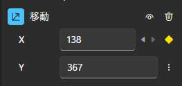

## キーフレーム

Beutlではキーフレームを用いて、
さまざまオブジェクトにアニメーション効果をつけることができます。

ここではキーフレームが何なのかについては説明しません。
すでに知っているものとして進めます。

### 準備
アニメーションを有効にする方法です。
1. アニメーション効果をつけたいプロパティの ︙ (三点リーダ縦) をクリックします。

2. __インライン表示でアニメーションを編集__ または __アニメーションを編集__ をクリックします。

3. アニメーションが有効になり、︙ (三点リーダ縦) が ◇ (ダイアモンド型) のアイコンになります。
   この状態では、右クリックすることでメニューを開けます。

### キーフレームを追加/削除

キーフレームを追加したいフレームで、◇ をクリックします。
◆ のようになればキーフレームが追加されています。

イージング一覧から追加したいイージングをドラッグアンドドロップで追加することもできます。

◆ をもう一度クリックすると削除できます。

### キーフレームのあるフレームに移動する
アニメーションが有効になっているプロパティは以下のようになっているはずです。

この `<` または `>` をクリックすることで、前後のキーフレームに移動することができます。

### イージング
メニューの __アニメーションを編集__ からアニメーションエディタを開くと、イージングを編集できます。

すでにあるキーフレームに対して、イージング一覧のイージングをドロップすると、イージングを変更できます。

また、デフォルトで設定されているイージングはスプラインイージングといい、
このイージングでは ○ 緑丸のコントロールポイントを使って、加減速を調整できます。

> [!TIP]
> コントロールポイントとキーフレームの表示が重なり、コントロールポイントが移動できなくなることがあります。  
> その時は `Alt` キーを押しながらドラッグ操作をすると、コントロールポイントを移動できます。

### アニメーションを削除
すべてのキーフレームを削除して、アニメーションを無効化するには、
◇ を右クリックしてメニューの __アニメーション削除__ をクリックします。

複雑なシーンの場合、使っていないアニメーションを削除することで、より高速に描画できます。
