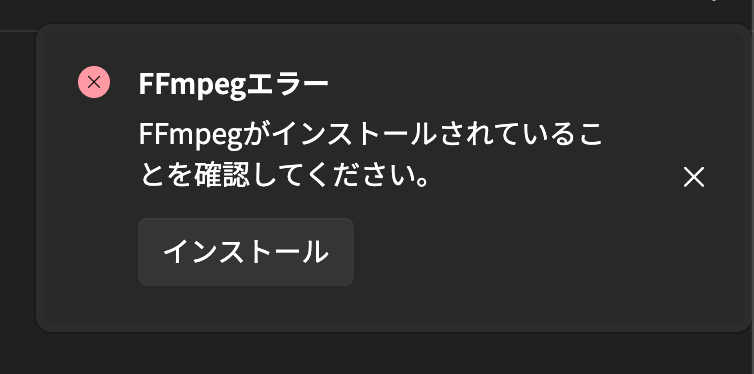

この操作を実行する前にFFmpegのライセンスをご確認ください。  
https://www.ffmpeg.org/legal.html

## 手動で配置する

**バージョンアップ等によって、ダウンロードするファイルが変わる可能があります。**

### Windows (64bit) の場合
以下のページから、`ffmpeg-n8.0-latest-win64-gpl-shared-8.0.zip`をダウンロードします。  
https://github.com/BtbN/FFmpeg-Builds/releases

ダウンロードしたファイルを展開して、
`ffmpeg-n8.0-latest-win64-gpl-shared-8.0\bin\`内のファイルを以下のように配置します。
```
C:\Users\(ユーザー)\.beutl\ffmpeg
┣━ avcodec-62.dll
┣━ avdevice-62.dll
┣━ avfilter-11.dll
┣━ avformat-62.dll
┣━ avutil-60.dll
┣━ ffmpeg.exe
┣━ ffplay.exe
┣━ ffprobe.exe
┣━ swresample-6.dll
┗━ swscale-9.dll
```

### Linuxの場合
**パッケージマネージャからインストールしたFFmpegはバージョンの違いなどにより、正常に動作しない場合があります。
なので、Windowsと同様に操作を行ってください。**

以下のページから、`ffmpeg-n8.0-latest-linux64-gpl-shared-8.0.tar.xz`をダウンロードします。  
https://github.com/BtbN/FFmpeg-Builds/releases

ダウンロードしたファイルを展開して、
`bin/`および`lib/`内のファイルを以下のように配置します。

```
/home/(ユーザー)/.beutl/ffmpeg
┣━ ffmpeg
┣━ ffplay
┣━ ffprobe
┣━ libavcodec.so
┣━ libavcodec.so.62
┣━ libavdevice.so
┣━ libavdevice.so.62
┣━ libavfilter.so
┣━ libavfilter.so.11
┣━ libavformat.so
┣━ libavformat.so.62
┣━ libavutil.so
┣━ libavutil.so.60
┣━ libswresample.so
┣━ libswresample.so.6
┣━ libswscale.so
┣━ libswscale.so.9
┣━ libavcodec.so.62.x.xxx
┣━ libavdevice.so.62.x.xxx
┣━ libavfilter.so.11.x.xxx
┣━ libavformat.so.62.x.xxx
┣━ libavutil.so.60.x.xxx
┣━ libswresample.so.6.x.xxx
┗━ libswscale.so.9.x.xxx
```
共有ライブラリの内、Suffixに`x.xxx`がついているもの以外はシンボリックリンクです。

### macOSの場合

> [!WARNING]
> Rosettaを使わないでください。

ターミナルで以下のコマンドを実行してHomebrewをインストールします。
```sh
/bin/bash -c "$(curl -fsSL https://raw.githubusercontent.com/Homebrew/install/HEAD/install.sh)"
```

以下のコマンドを実行してFFmpegをインストールします。
```sh
brew install ffmpeg@8
```

## アプリ内から配置する

> [!TIP]
> 1.1.0から利用可能です．

FFmpegがインストールされていない場合，Beutlを起動したときに以下のような通知が表示されます．


この通知の __インストール__ ボタンをクリックすると，FFmpegのインストールダイアログが起動します．

このダイアログではWindows，Linuxの場合は BtbN/FFmpeg-Builds から，macOSの場合は Homebrew からFFmpegをインストールできます．
Homebrewがインストールされていない場合は自動的にインストールされます．

## [FFmpeg配置ツール](https://beutl.beditor.net/ja/store/Beutl.Extensions.FFmpegLocator)を使う

> [!WARNING]
> この拡張機能は廃止予定です

バージョン`1.0.0-preview4`以降は[FFmpeg配置ツール](https://beutl.beditor.net/ja/store/Beutl.Extensions.FFmpegLocator)を使うことができます。

> [!TIP]
> この方法を実行するにはBeutlアカウントが必要です。  
> あらかじめ、設定ウィンドウのアカウントページから、サインインしてください。

1. __ツール > 拡張機能__ ウィンドウを開きます
2. __"FFmpeg配置ツール"__ をクリックします。
4. インストールをクリックします。
5. Beutlを閉じます。
6. インストールダイアログが表示されるので指示に従って続行します。
7. Beutlを開きます。
8. __ツール__ から __"FFmpeg配置ツール"__ を開きます。
9. __インストール__ をクリックするとFFmpegのインストールが開始されます。
10. インストールが終了したら、Beutlを再起動すると配置が完了します。

> [!TIP]
> この作業が終わったあとは、__"FFmpeg配置ツール"__ をアンインストールしていただいても構いません。

## トラブルシューティング

### FFmpegのバージョンの問題
インストール後も __"FFmpegがインストールされていることを確認してください。"__ と表示される場合、
FFmpegのバージョンが間違っている可能性があります。
正しいバージョンは[バージョンマッピング](../extensions/version-mapping.md)からご確認ください。

FFmpeg配置ツールを使用しているにもかかわらず、
メッセージが表示される場合、[こちら](https://github.com/b-editor/Beutl.Extensions.FFmpegLocator/issues)に報告していただけると助かります。
