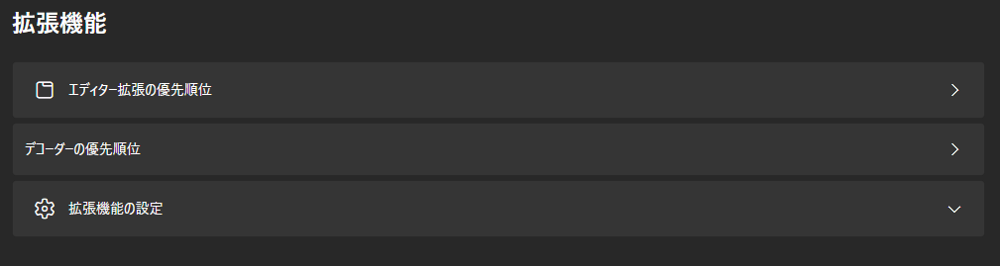
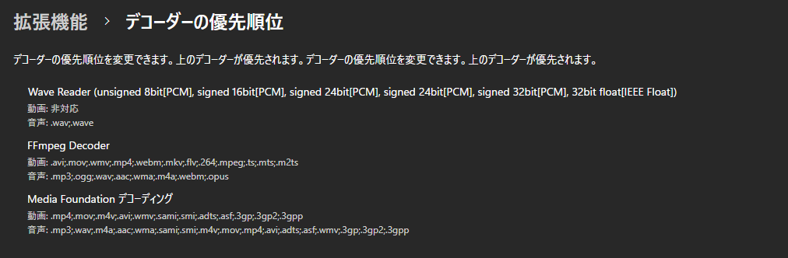
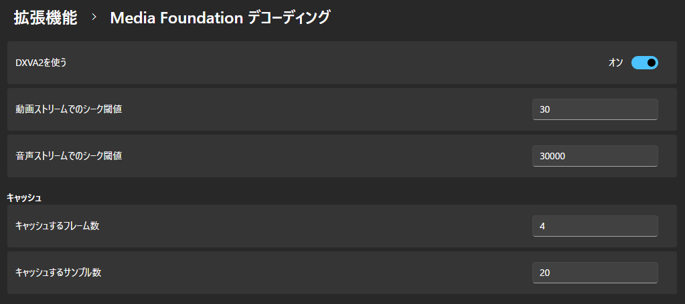

## デコーダーの優先順位

デコーダーの優先順位を変更します。
リストの上のデコーダーが優先されます。

## 拡張機能の設定

拡張機能の個別の設定を変更します。
### FFmpeg Decoder

#### Scaling

スケーリングアルゴリズムを設定します。

詳しくは[こちら](https://ffmpeg.org/ffmpeg-scaler.html#toc-Scaler-Options)をご覧ください。

- FastBilinear
- Bilinear
- Bicubic __(デフォルト値)__
- X
- Point
- Area
- Bicublin
- Gauss
- Sinc
- Lanczos
- Spline

#### ThreadCount

デコードに使用するスレッド数を設定します。

0未満を指定すると、デバイスのスレッド数 (最大16) を使用します。  
0を指定すると、FFmpegが自動でスレッド数を検出するらしいです。

デフォルト値は __"-1"__ です。

### Media Foundation デコーディング

#### DXVA2を使う

DirectX ビデオ アクセラレータ 2.0を使用して高速に動画をデコードします。

デフォルト値は __"オン"__ です。

#### 動画ストリームのシーク閾値

このフレーム数より遠いフレームが読み込まれる場合、シークします。

デフォルト値は __"30"__ です。

#### 音声ストリームのシーク閾値

このサンプル数より遠いサンプルが読み込まれる場合、シークします。

デフォルト値は __"30000"__ です。

#### キャッシュするフレーム数

デフォルト値は __"4"__ です。

#### キャッシュするサンプル数

デフォルト値は __"20"__ です。