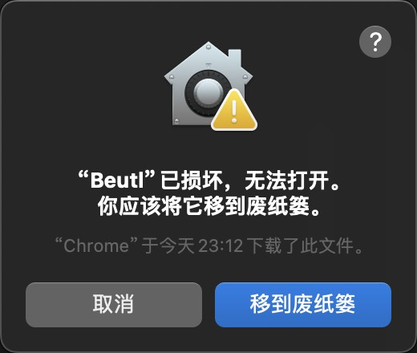

这篇文章将以版本为 `{version}` 的 Beutl 为例，说明 Beutl 的安装方法。

## 安装前的准备
请先安装 [.NET 8 运行时](https://dotnet.microsoft.com/zh-cn/download/dotnet/8.0)。

> [!TIP]  
> 请根据要安装的 Beutl 版本确定 .NET 的版本。  
> [版本对照表](../extensions/version-mapping.md)

## 安装 Windows 版本

### 使用安装程序
1. 下载并运行 `beutl-setup.exe`。
2. 按照屏幕上的指示进行安装。
3. 请参考 [安装 FFmpeg](./ffmpeg-install.md) 中的方法，安装 FFmpeg。
4. 运行 `Beutl.exe`。

### 手动安装
1. 下载并解压 `beutl-win-x64-{version}.zip`。
2. 请参考 [安装 FFmpeg](./ffmpeg-install.md) 中的方法，安装 FFmpeg。
3. 运行 `Beutl.exe`。

## 为 Ubuntu 22.04 安装

### 从 Debian 包安装

> [!TIP]  
> 此方法仅从 `1.0.0-preview.5` 开始可用。

1. 下载 `beutl_1.0.0-285ubuntu22.04_amd64.deb`。
2. 执行以下命令：
```sh
sudo apt update
sudo apt install ./beutl_1.0.0-285ubuntu22.04_amd64.deb
```
3. 安装完成。

### 手动安装
1. 下载并解压 `beutl-linux-x64-{version}.zip`。
2. 请参考 [安装 FFmpeg](./ffmpeg-install.md) 中的方法，安装 FFmpeg。
3. 使用 `chmod` 使 `Beutl`, `Beutl.ExceptionHandler`, `Beutl.PackageTools`, `Beutl.WaitingDialog` 可执行。
4. 启动 `Beutl`。

> [!IMPORTANT]  
> 如果要安装 `1.0.0-preview.5` 以下的版本，请参考 [这里](https://github.com/shimat/opencvsharp#ubuntu) 的方法来构建 `libOpenCvSharpExtern`。

## 安装 macOS 版本

下载并解压 `Beutl.osx_arm64.app.zip` 或 `Beutl.osx_x64.app.zip`。  
您应该会看到如下警告：


因为 Beutl 没有进行数字签名，所以会出现这个警告。  
需要执行以下命令来绕过数字签名：
```sh
xattr -rc Beutl.app
```
